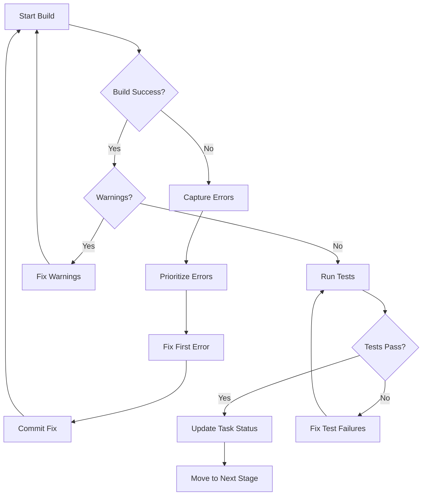

# CONTB - Continue, Build & Resolve

> Automated build continuation with progressive error/warning resolution

## Command: /contb

### Purpose
Continues development work by:
1. Running the build process
2. Capturing all errors and warnings
3. Systematically resolving each issue
4. Re-building until clean (0 errors, 0 warnings)
5. Moving task to next pipeline stage when complete

### Usage
```
/contb [options]

Options:
  --task-id <id>     Specify task being worked on
  --platform <ios|web|all>  Target platform (default: ios)
  --fix-style        Also fix code style/linting issues
  --test             Run tests after successful build
  --verbose          Show detailed build output
```

### Workflow



### Build Commands by Project Type

#### iOS/Swift Project (AIKO)
```bash
# Initial build
xcodebuild -scheme AIKO -configuration Debug build

# With specific SDK
xcodebuild -scheme AIKO -sdk iphonesimulator -configuration Debug

# Clean build
xcodebuild -scheme AIKO clean build

# Run tests
xcodebuild test -scheme AIKO -destination 'platform=iOS Simulator,name=iPhone 15'
```

#### Swift Package
```bash
# Build
swift build

# Test
swift test

# Clean
swift package clean
```

### Error Resolution Strategy

#### 1. Compilation Errors (Priority 1)
- Missing imports
- Type mismatches  
- Undefined symbols
- Syntax errors

#### 2. Linker Errors (Priority 2)
- Missing frameworks
- Duplicate symbols
- Architecture mismatches

#### 3. Warnings (Priority 3)
- Deprecated APIs
- Unused variables
- Documentation warnings
- Code style issues

#### 4. Test Failures (Priority 4)
- Unit test failures
- Integration test failures
- UI test failures

### Implementation Process

```markdown
## 🔨 CONTB Session: [Task Name]

### Build Attempt #1
```bash
$ xcodebuild -scheme AIKO build
```

**Status**: ❌ Failed
**Errors**: 5
**Warnings**: 12

### Error Analysis:
1. **Error**: Use of unresolved identifier 'DocumentParser'
   - **File**: ContentView.swift:45
   - **Fix**: Import DocumentProcessing module
   
2. **Error**: Cannot convert value of type 'String' to expected 'URL'
   - **File**: FileHandler.swift:23  
   - **Fix**: Use URL(string:) initializer

### Fixing Error #1...
[Show code fix]

### Build Attempt #2
[Continue until clean]

### Final Status: ✅ Success
- Errors: 0
- Warnings: 0  
- Tests: Passing
- Task Status: Ready for 05_Completed_Tasks.md
```

### Auto-Fix Patterns

#### Common Swift/iOS Fixes:
```swift
// Missing import
+ import DocumentProcessing

// Optional handling
- let url = URL(string: path)
+ guard let url = URL(string: path) else { return }

// Async/await migration  
- completion: { result in
+ Task {
+     let result = await

// Deprecated API
- UIApplication.shared.statusBarOrientation
+ UIApplication.shared.windows.first?.windowScene?.interfaceOrientation
```

### Task Integration

After successful build:
1. Update Task Master AI status
2. Move task file to next stage
3. Update subtask completion
4. Log build metrics

```bash
# Update task status
/task-master-ai.set_task_status --projectRoot /Users/J/aiko --id 1.1 --status completed

# Add completion note
/task-master-ai.update_task --projectRoot /Users/J/aiko --id 1.1 --prompt "Build successful: 0 errors, 0 warnings. All tests passing."
```

### Success Criteria

Task moves to next stage when:
- ✅ Build succeeds (exit code 0)
- ✅ 0 compilation errors
- ✅ 0 warnings  
- ✅ All tests pass
- ✅ Code coverage > 80%
- ✅ No security vulnerabilities
- ✅ Documentation updated

### Example Output

```
🔨 CONTB: Starting build process for Task 1.1 - PDF Parser

Build #1... ❌ (3 errors, 7 warnings)
  → Fixing: Missing import for Vision framework
  → Fixing: Incorrect optional unwrapping
  → Fixing: Type mismatch in completion handler

Build #2... ❌ (0 errors, 7 warnings)  
  → Fixing: Deprecated API usage (3)
  → Fixing: Unused variables (2)
  → Fixing: Force unwrapping (2)

Build #3... ✅ (0 errors, 0 warnings)
  → Running tests...
  → Tests: 42 passed, 0 failed
  → Coverage: 87%

✅ Task 1.1 build complete! Moving to Completed stage.

Next: /task-master-ai.set_task_status --projectRoot /Users/J/aiko --id 1.1 --status completed
```

### Error Database

Common errors and solutions are tracked for faster resolution:
- Import errors → Auto-add imports
- Type mismatches → Suggest conversions
- Async issues → Migrate to async/await
- Memory leaks → Add weak references
- Thread safety → Add actor isolation