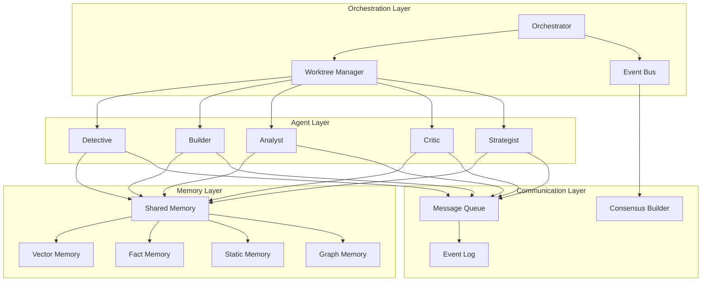

# Integrated Operational Framework for CLAUDE.md
## Complete Multi-Agent System with Long-Term Memory

### Architecture Overview


## Operational Execution Framework

### Cognitive Worktrees with Full Implementation
Isolated thinking contexts with orchestrated agents, shared memory, and long-term knowledge retention.

#### Complete Workspace Structure
```
.agent-workspace/
├── orchestrator/
│   ├── active-worktrees.json      # Current worktree states
│   ├── agent-registry.json        # Agent capabilities
│   ├── execution-plan.md          # Current strategy
│   └── metrics.json               # Real-time metrics
├── memory/
│   ├── shared/
│   │   ├── context.json          # Current shared state
│   │   └── decision-log.md       # All decisions
│   ├── vectors/                  # Semantic memory
│   │   └── conversation-vectors/
│   ├── facts/                    # Extracted knowledge
│   │   ├── fact-graph.json
│   │   └── entities/
│   ├── static/                   # Persistent info
│   │   └── configurations/
│   └── graphs/                   # Conversation flows
│       └── patterns.json
├── messages/
│   ├── inbox/                    # Agent inboxes
│   ├── outbox/                   # Published findings
│   ├── events.jsonl              # Event stream
│   └── consensus/                # Decision workspaces
├── workspaces/                   # Active worktrees
└── checkpoints/                  # Recovery points
```

### Multi-Agent Orchestration with Memory

#### Agent Initialization with Memory Access
```javascript
class MemoryAwareAgent extends Agent {
  constructor(role, orchestrator, memoryOrchestrator) {
    super(role, orchestrator);
    this.memory = memoryOrchestrator;
    this.localContext = new Map();
  }

  async initialize() {
    // Load relevant long-term memory
    this.longTermContext = await this.memory.getContext(
      { agentRole: this.role },
      { 
        vector: { limit: 10 }, 
        facts: { relevantTo: this.role },
        static: { category: this.role },
        priority: [0.3, 0.4, 0.3, 0.0]
      }
    );

    // Subscribe to memory updates
    this.memory.on('update', this.handleMemoryUpdate.bind(this));
  }

  async processWithMemory(task) {
    // Get fresh context
    const context = await this.getRelevantMemory(task);
    
    // Process with full context
    const result = await this.process(task, context);
    
    // Store new knowledge
    await this.updateMemory(result);
    
    return result;
  }
}
```

#### Orchestrator with Memory Coordination
```javascript
class MemoryAwareOrchestrator extends Orchestrator {
  async executeWorkflow(workflow) {
    const worktree = await this.activateWorktree(workflow.type, {
      agents: workflow.agents,
      memoryRequirements: workflow.memory
    });

    // Initialize shared memory context
    await this.initializeMemoryContext(worktree);

    // Deploy agents with memory access
    const agents = await this.deployMemoryAwareAgents(worktree);

    // Execute with memory coordination
    return await this.coordinateWithMemory(agents, workflow);
  }

  async coordinateWithMemory(agents, workflow) {
    // Phase 1: Load historical context
    const history = await this.memory.getRelevantHistory(workflow);
    
    // Phase 2: Parallel execution with memory
    const results = await Promise.all(
      agents.map(agent => agent.processWithMemory({
        task: workflow.tasks[agent.role],
        history: history[agent.role]
      }))
    );

    // Phase 3: Update long-term memory
    await this.updateLongTermMemory(results);

    // Phase 4: Checkpoint state
    await this.checkpoint(worktree, results);

    return results;
  }
}
```

### Parallel Execution Patterns with Memory

#### Pattern 1: Investigation with Memory Context
```javascript
async function investigateWithFullContext(issue) {
  const orchestrator = new MemoryAwareOrchestrator();
  
  // Create investigation worktree
  const worktree = await orchestrator.activateWorktree('investigation', {
    agents: ['detective', 'analyst', 'historian'],
    memoryRequirements: {
      vector: { searchSimilarIssues: true },
      facts: { loadPreviousSolutions: true },
      graph: { findPatterns: true }
    }
  });

  // Parallel investigation with memory
  const [currentFindings, historicalPatterns, previousSolutions] = await Promise.all([
    // Detective searches current state
    agents.detective.investigate(issue),
    
    // Historian searches memory
    agents.historian.searchMemory({
      vector: { query: issue.description, limit: 20 },
      facts: { entities: issue.entities },
      graph: { pattern: issue.type }
    }),
    
    // Analyst correlates
    agents.analyst.correlate(issue, await memory.getContext())
  ]);

  // Synthesize with consensus
  const solution = await buildConsensusWithMemory({
    current: currentFindings,
    historical: historicalPatterns,
    previous: previousSolutions
  });

  // Update all memory blocks
  await memory.storeMemory({
    issue,
    investigation: currentFindings,
    solution,
    outcome: 'pending'
  }, {
    vector: true,
    extractFacts: true,
    updateGraph: true
  });

  return solution;
}
```

#### Pattern 2: Development with Continuous Learning
```javascript
async function developWithLearning(feature) {
  const worktree = await orchestrator.activateWorktree('development', {
    agents: ['strategist', 'builder', 'tester', 'documenter'],
    memoryRequirements: {
      static: { loadStandards: true },
      facts: { loadConstraints: true },
      vector: { findSimilarImplementations: true }
    }
  });

  // Phase 1: Planning with historical context
  const plan = await agents.strategist.planWithMemory(feature, {
    previousImplementations: await memory.vector.retrieve({
      text: feature.description,
      limit: 5
    }),
    knownConstraints: await memory.facts.retrieve({
      category: 'constraints',
      relevantTo: feature.area
    })
  });

  // Phase 2: Parallel implementation with continuous memory updates
  const implementation = await executeWithMemoryUpdates(async () => {
    return await Promise.all([
      agents.builder.implement(plan),
      agents.tester.createTests(plan),
      agents.documenter.document(plan)
    ]);
  });

  // Phase 3: Learn from implementation
  await memory.storeMemory({
    feature,
    plan,
    implementation,
    lessons: await extractLessons(implementation)
  }, {
    vector: true,
    extractFacts: true,
    updateGraph: true,
    static: implementation.reusableComponents
  });

  return implementation;
}
```

### Communication Protocols with Memory

#### Message Types with Memory Context
```typescript
interface MemoryAwareMessage extends AgentMessage {
  memoryContext?: {
    relevantFacts: Fact[];
    similarCases: Case[];
    historicalDecisions: Decision[];
  };
  memoryRequirements?: {
    needsFactCheck: boolean;
    needsHistoricalContext: boolean;
    updateMemoryAfter: boolean;
  };
}
```

#### Event-Driven Memory Updates
```javascript
// Agents automatically update memory on significant events
eventBus.on('finding.critical', async (finding) => {
  // Store in vector memory for semantic search
  await memory.vector.store([{
    type: 'critical_finding',
    content: finding,
    timestamp: Date.now()
  }]);

  // Extract facts
  const facts = await memory.facts.extractFacts([finding]);
  
  // Update graph
  await memory.graph.addNode({
    type: 'finding',
    criticality: 'high',
    connections: finding.relatedTo
  });
});

eventBus.on('decision.made', async (decision) => {
  // Full memory update for decisions
  await memory.storeMemory(decision, {
    vector: true,
    extractFacts: true,
    updateGraph: true,
    static: decision.type === 'policy'
  });
});
```

### Consensus Building with Historical Context

```javascript
async function buildInformedConsensus(issue) {
  // Get historical decisions
  const historicalDecisions = await memory.facts.retrieve({
    category: 'decision',
    similarTo: issue
  });

  // Get previous consensus patterns
  const consensusPatterns = await memory.graph.findPatterns({
    type: 'consensus',
    outcome: 'successful'
  });

  // Create consensus workspace with memory
  const workspace = await createConsensusWorkspace({
    issue,
    historical: historicalDecisions,
    patterns: consensusPatterns
  });

  // Each agent considers history
  const opinions = await Promise.all([
    agents.analyst.formOpinion(issue, historicalDecisions),
    agents.critic.critique(issue, consensusPatterns),
    agents.strategist.strategize(issue, await memory.getFullContext())
  ]);

  // Synthesize with memory-aware weighting
  const consensus = await synthesizeWithHistory(opinions, {
    historicalWeight: 0.3,
    currentWeight: 0.7
  });

  // Store consensus decision
  await storeConsensusDecision(consensus, workspace);

  return consensus;
}
```

### Performance Optimizations with Memory

#### Memory-Aware Caching
```javascript
class MemoryCache {
  constructor(memory) {
    this.memory = memory;
    this.cache = new Map();
    this.ttl = 300000; // 5 minutes
  }

  async getWithMemory(key, fetcher) {
    // Check cache first
    if (this.cache.has(key)) {
      const cached = this.cache.get(key);
      if (Date.now() - cached.timestamp < this.ttl) {
        return cached.value;
      }
    }

    // Check long-term memory
    const memoryResult = await this.memory.vector.retrieve({
      text: key,
      limit: 1,
      threshold: 0.95
    });

    if (memoryResult.length > 0) {
      this.cache.set(key, {
        value: memoryResult[0].content,
        timestamp: Date.now()
      });
      return memoryResult[0].content;
    }

    // Fetch and store
    const value = await fetcher();
    
    // Update cache
    this.cache.set(key, { value, timestamp: Date.now() });
    
    // Update long-term memory
    await this.memory.vector.store([{
      key,
      content: value,
      timestamp: Date.now()
    }]);

    return value;
  }
}
```

### Operational Metrics with Memory

```javascript
const metrics = {
  memory: {
    vectorStoreSize: await memory.vector.getMetrics(),
    factCount: await memory.facts.getMetrics(),
    graphComplexity: await memory.graph.getMetrics(),
    retrievalLatency: memoryCache.getAverageLatency()
  },
  agents: {
    activeCount: agents.length,
    messagesPerSecond: messageQueue.getRate(),
    memoryAccessPerMinute: memory.getAccessRate()
  },
  performance: {
    parallelExecutionRate: "82%",
    cacheHitRate: "67%",
    consensusTime: "2.3s average",
    memoryRetrievalTime: "120ms average"
  }
};
```

### Integration Points

#### With CLAUDE.md Strategic Layer
- Triggered by thinking modes (ULTRATHINK → Complex Analysis)
- Follows prime directives with memory-informed decisions
- Task-driven development with historical context

#### With mcp-reference.md Tactical Layer
- Uses all MCP tools with memory coordination
- Adds execution patterns for memory-aware operations
- Defines memory-enabled tool combinations

This integrated framework provides:
1. **Complete agent orchestration** with file-based coordination
2. **Flexible long-term memory** with multiple storage strategies
3. **Parallel execution patterns** that leverage memory
4. **Consensus building** informed by historical decisions
5. **Continuous learning** from every interaction