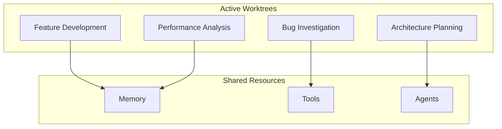
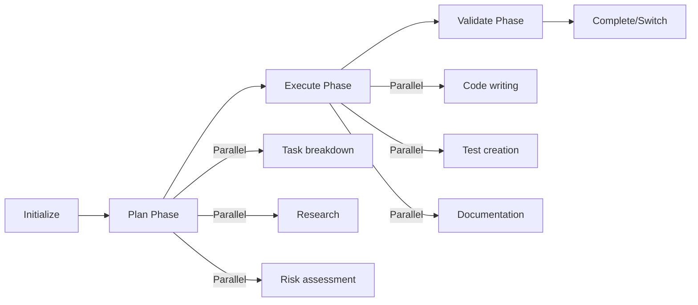

# Operational Framework for Claude Code
## Cognitive Worktrees & Multi-Agent Orchestration

> **Version**: 1.0.0  
> **Purpose**: Bridge strategic philosophy (CLAUDE.md) with tactical implementation (mcp-reference.md)  
> **Focus**: HOW to execute complex tasks using parallel tools and multi-agent patterns

---

## Core Concepts

### 1. Cognitive Worktrees
Isolated thinking contexts that maintain state and focus for specific problem domains.



### 2. Worktree Types

| Worktree Type | Primary Tools | Agent Configuration | Parallel Patterns |
|---------------|---------------|-------------------|-------------------|
| **Investigation** | `Task`, `zen.debug`, `ast-grep` | Detective + Analyst | Search + Analyze + Validate |
| **Development** | `filesystem`, `TodoWrite`, `git` | Builder + Reviewer | Plan + Code + Test |
| **Analysis** | `zen.analyze`, `zen.thinkdeep`, `memory` | Researcher + Critic | Gather + Process + Synthesize |
| **Planning** | `zen.planner`, `TodoWrite`, `consensus` | Strategist + Validator | Design + Validate + Refine |
| **Review** | `zen.codereview`, `github`, `precommit` | Inspector + Advisor | Check + Suggest + Verify |

---

## Operational Patterns

### Pattern 1: Multi-Agent Investigation
```yaml
worktree: investigation
agents:
  - searcher: Find all occurrences
  - analyzer: Understand patterns
  - validator: Verify findings
execution:
  parallel:
    - Task[search for "error patterns"]
    - ast-grep[find error handlers]
    - grep[search logs]
  sequential:
    - zen.analyze[synthesize findings]
    - zen.consensus[validate approach]
```

### Pattern 2: Parallel Tool Execution
```javascript
// ALWAYS batch independent operations
async function parallelDevelopment() {
  await Promise.all([
    // File operations
    filesystem.read_multiple_files(['src/*.ts']),
    // Git status
    git.status(),
    git.diff_unstaged(),
    // Task status
    TodoWrite.getTasks(),
    // Memory recall
    memory.search("current feature")
  ]);
}
```

### Pattern 3: Multi-Model Consensus Building
```javascript
// For critical decisions - run models in parallel
async function architectureDecision() {
  const perspectives = await Promise.all([
    zen.chat({ 
      model: "anthropic/claude-opus-4",
      prompt: "Architecture analysis...",
      role: "Senior Architect"
    }),
    zen.chat({
      model: "openai/o3",
      prompt: "Same analysis...",
      role: "Performance Expert"
    }),
    zen.chat({
      model: "google/gemini-2.5-pro",
      prompt: "Same analysis...",
      role: "Security Auditor"
    })
  ]);
  
  return zen.consensus({
    perspectives,
    decision_framework: "weighted_expertise"
  });
}
```

---

## Worktree Lifecycle

### 1. Initialization
```markdown
[WORKTREE: Feature-Auth-System]
Type: Development
Agents: [Builder, Tester, Reviewer]
Tools: [TodoWrite, filesystem, git, zen]
State: Active
Context: Implementing JWT authentication
```

### 2. Execution Phases


### 3. State Persistence
```javascript
// Worktree state saved on switch/pause
const worktreeState = {
  id: "feature-auth-system",
  type: "development",
  activeTask: "task-5.2",
  context: {
    files: ["src/auth/*"],
    decisions: ["use JWT", "PKCE flow"],
    blockers: [],
    nextSteps: ["implement refresh tokens"]
  },
  agents: {
    builder: { progress: 60 },
    tester: { coverage: 45 },
    reviewer: { findings: [] }
  }
};
```

---

## Multi-Agent Orchestration Rules

### 1. Agent Roles & Responsibilities

| Agent Role | Responsibilities | Tool Preferences | Communication Style |
|------------|-----------------|------------------|-------------------|
| **Detective** | Find issues, trace problems | `Task`, `ast-grep`, `grep` | Facts and evidence |
| **Builder** | Create solutions | `filesystem`, `git` | Implementation focused |
| **Analyst** | Deep understanding | `zen.analyze`, `thinkdeep` | Patterns and insights |
| **Critic** | Challenge assumptions | `zen.challenge`, `consensus` | Constructive questioning |
| **Strategist** | Long-term planning | `zen.planner`, `TodoWrite` | Vision and roadmap |
| **Inspector** | Quality assurance | `zen.codereview`, `secaudit` | Standards compliance |

### 2. Parallel Execution Matrix

```yaml
can_parallelize:
  - Different file reads
  - Independent searches  
  - Multiple model queries
  - Separate git operations
  - Distinct API calls

must_serialize:
  - Write → Read same file
  - Create → Update operations
  - Dependent task chains
  - State modifications
  - Transaction sequences
```

### 3. Agent Communication Protocols

```javascript
// Event-driven communication
const agentBus = {
  // Broadcast findings
  detective: {
    emit: "evidence.found",
    data: { pattern: "SQL injection", location: "user.js:45" }
  },
  
  // Request validation
  builder: {
    emit: "validation.request", 
    data: { implementation: "auth.ts", needsReview: true }
  },
  
  // Consensus building
  critic: {
    emit: "consensus.needed",
    data: { issue: "architecture choice", options: [...] }
  }
};
```

---

## Operational Execution Framework

### 1. Task Decomposition Strategy
```markdown
[ULTRATHINK] → Break into worktrees:
1. Parse requirement → Planning Worktree
2. Investigate current state → Investigation Worktree  
3. Implement solution → Development Worktree
4. Validate results → Review Worktree
```

### 2. Parallel Tool Invocation
```javascript
// MANDATORY: Batch all independent operations
async function efficientExecution() {
  // Phase 1: Gather (parallel)
  const [files, tasks, memory, git] = await Promise.all([
    filesystem.read_multiple_files(relevantFiles),
    TodoWrite.getTasks(),
    memory.search("project context"),
    git.status({ repo_path: "." })
  ]);
  
  // Phase 2: Process (parallel agents)
  const analyses = await Promise.all([
    agent.detective.investigate(files),
    agent.analyst.process(files),
    agent.strategist.plan(tasks)
  ]);
  
  // Phase 3: Synthesize (sequential)
  const decision = await zen.consensus({
    inputs: analyses,
    models: ["opus-4", "o3", "gemini-pro"]
  });
  
  return decision;
}
```

### 3. Context Switching Protocol
```markdown
On Worktree Switch:
1. Save current state → memory.create_entities
2. Persist active files → filesystem metadata
3. Record decisions → TodoWrite update
4. Clear working memory → explicit cleanup
5. Load new context → memory.search + restore
```

---

## Performance Optimizations

### 1. Batching Strategy
- **Always batch**: File reads, API calls, model queries
- **Never batch**: Sequential dependencies, state mutations
- **Batch size**: 5-10 operations per call

### 2. Caching Patterns
```javascript
const cache = {
  fileContents: new Map(),    // 5-minute TTL
  searchResults: new Map(),   // 10-minute TTL
  modelResponses: new Map(),  // 15-minute TTL
  gitStatus: new Map()        // 1-minute TTL
};
```

### 3. Resource Allocation
```yaml
worktree_limits:
  max_active: 4
  max_agents_per_worktree: 3
  max_parallel_tools: 10
  context_budget_per_worktree: 25%
```

---

## Integration with CLAUDE.md

### Operational Triggers
```javascript
// When ULTRATHINK is triggered
if (thinkingMode === 'ULTRATHINK') {
  activateWorktree('complex-analysis', {
    agents: ['analyst', 'critic', 'strategist'],
    parallelTools: ['zen.thinkdeep', 'TodoWrite', 'memory.search'],
    consensusRequired: true
  });
}

// When debugging
if (task.type === 'debug') {
  activateWorktree('investigation', {
    agents: ['detective', 'analyst'],
    parallelTools: ['zen.debug', 'ast-grep.find', 'git.diff'],
    traceEnabled: true
  });
}
```

---

## Example: Complete Operational Flow

```markdown
User: "Fix the authentication bug where users can't log in"

[OPERATIONAL EXECUTION]

1. **Initialize Investigation Worktree**
   - Agents: Detective, Analyst
   - Tools: zen.debug, ast-grep, git, filesystem
   
2. **Parallel Phase 1: Gather Evidence**
   ```javascript
   await Promise.all([
     Task("search for auth error patterns"),
     ast-grep.find_code("login|auth|session"),
     git.diff_unstaged({ context_lines: 10 }),
     filesystem.search_files({ pattern: "*auth*" })
   ]);
   ```

3. **Parallel Phase 2: Multi-Agent Analysis**
   - Detective: Traces error flow
   - Analyst: Identifies patterns
   - Both work simultaneously
   
4. **Consensus Building**
   ```javascript
   await zen.consensus({
     models: ["anthropic/claude-opus-4", "openai/o3"],
     findings: detectedIssues,
     proposedFixes: solutions
   });
   ```

5. **Switch to Development Worktree**
   - Save investigation state
   - Initialize development context
   - Activate Builder agent
   
6. **Parallel Implementation**
   - Fix code (Builder)
   - Write tests (Tester) 
   - Update docs (Documenter)
   
7. **Validation & Completion**
   - Run all tests in parallel
   - Get multi-model code review
   - Update task status
```

---

## Metrics & Monitoring

### Performance Indicators
- Parallel execution rate: >70% of operations
- Agent utilization: >80% during active work
- Context switch time: <2 seconds
- Cache hit rate: >60%

### Operational Health Checks
```javascript
const healthCheck = {
  activeWorktrees: worktreeManager.list(),
  parallelOpsInFlight: executor.pending(),
  agentLoad: agents.map(a => ({ id: a.id, load: a.utilization() })),
  memoryPressure: context.usage(),
  toolLatency: tools.getAverageLatency()
};
```

---

This operational framework enables systematic, efficient execution through cognitive isolation, parallel processing, and multi-agent collaboration.