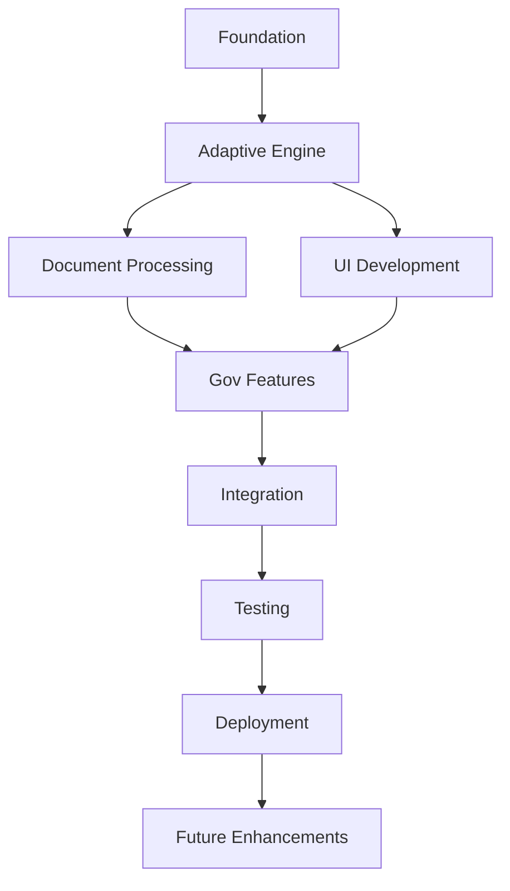

# AIKO Project Tasks - Comprehensive Overview

**Project**: AIKO (Adaptive Intelligence for Kontract Optimization)  
**Version**: 2.0.0  
**Date**: July 14, 2025  
**Status**: In Progress  

---

## 🎯 Project Vision

Build an intelligent iOS/macOS application that revolutionizes government contracting by learning from user patterns, minimizing questions, and automating document processing through adaptive AI.

---

## 📋 Master Task List

### Phase 1: Foundation & Architecture ✅

#### Task 1: Project Setup and Core Infrastructure ✅
- **1.1** Initialize SwiftUI + TCA project structure ✅
- **1.2** Configure development environment and dependencies ✅
- **1.3** Set up Core Data for persistence ✅
- **1.4** Implement TodoWrite-only task management ✅
- **1.5** Remove legacy task tracking systems ✅
- **1.6** Create comprehensive documentation structure ✅

### Phase 2: Adaptive Intelligence Engine 🚧

#### Task 2: Build Adaptive Prompting Engine with Minimal Questioning 🚧
- **2.1** Design conversational flow architecture ✅
  - Created `AdaptivePromptingEngine.swift`
  - Defined conversation states and session management
  - Implemented dynamic question generation
  
- **2.2** Implement context extraction from documents ✅
  - Created `UnifiedDocumentContextExtractor.swift`
  - Integrated Vision framework for OCR
  - Built adaptive pattern learning system
  - Implemented confidence scoring
  
- **2.3** Create user pattern learning module 🚧
  - Design `UserPatternLearningEngine`
  - Implement pattern recognition algorithms
  - Build preference storage system
  - Create learning feedback loops
  
- **2.4** Build smart defaults system 📅
  - Implement field prediction based on history
  - Create contextual default values
  - Build confidence-based auto-fill
  
- **2.5** Integrate with Claude API for natural conversation 📅
  - Set up Claude API client
  - Implement conversation state management
  - Create response parsing system
  - Build error handling and retry logic

### Phase 3: Document Processing Pipeline 📅

#### Task 3: Advanced Document Parser Implementation
- **3.1** Enhance OCR accuracy for government documents
- **3.2** Implement table extraction from PDFs
- **3.3** Build multi-page document handling
- **3.4** Create document validation system
- **3.5** Implement batch document processing

#### Task 4: Intelligent Data Extraction
- **4.1** Build contract clause identification
- **4.2** Implement pricing structure analysis
- **4.3** Create compliance requirement extraction
- **4.4** Build vendor capability matching
- **4.5** Implement risk assessment extraction

### Phase 4: User Interface & Experience 📅

#### Task 5: SwiftUI Interface Development
- **5.1** Design main dashboard view
- **5.2** Create document upload interface
- **5.3** Build conversational UI component
- **5.4** Implement progress tracking views
- **5.5** Create settings and preferences screens

#### Task 6: Adaptive UI Components
- **6.1** Build smart form fields with predictions
- **6.2** Create confidence indicators
- **6.3** Implement contextual help system
- **6.4** Build document preview with highlights
- **6.5** Create learning feedback interface

### Phase 5: Government Contracting Features 📅

#### Task 7: Acquisition Workflow Management
- **7.1** Implement RFQ/RFP generation
- **7.2** Build vendor evaluation matrix
- **7.3** Create compliance checklist system
- **7.4** Implement approval workflow
- **7.5** Build audit trail functionality

#### Task 8: Vendor Management System
- **8.1** Create vendor database
- **8.2** Implement capability matching
- **8.3** Build performance tracking
- **8.4** Implement vendor document repository

### Phase 6: Integration & APIs 📅

#### Task 9: External System Integration
- **9.1** SAM.gov API integration
- **9.2** Document management system integration
- **9.3** Email and calendar integration

#### Task 10: Better_Auth Implementation
- **10.1** Set up authentication infrastructure
- **10.2** Implement role-based access control
- **10.3** Create user management system
- **10.4** Build security audit logging
- **10.5** Implement two-factor authentication

### Phase 7: Advanced Features 📅

#### Task 11: Machine Learning Enhancements
- **11.1** Train custom models for gov contracting
- **11.2** Implement anomaly detection
- **11.3** Build predictive analytics
- **11.4** Create recommendation engine
- **11.5** Implement continuous learning

#### Task 12: n8n Workflow Automation (Performance-First Strategy) 🚧
> **Note**: Following a performance-first architecture to ensure enterprise-scale reliability before implementing business logic. See `/Users/J/Desktop/n8n aiko/` for detailed documentation and completed workflows.

##### Phase 1: Performance Foundation (Weeks 1-6) - 20% Complete
- **12.1.1** Real-time API Batching (40% fewer queries) ✅
- **12.1.2** Auto Cache Invalidation (5x faster reads) ✅
- **12.1.3** Log Aggregation & Anomaly Detection (30% less downtime) 📅
- **12.1.4** Auto-scaling Triggers (instant scaling) 📅
- **12.1.5** DB Index Optimization (7x faster queries) 📅
- **12.1.6** Rate-limiting (99.9% uptime) 📅
- **12.1.7** Health Monitoring (80% faster recovery) 📅
- **12.1.8** Asset Preloading (60% faster loads) 📅
- **12.1.9** JWT Rotation (85ms auth time) 📅
- **12.1.10** Distributed Tracing (4x debug speed) 📅

##### Phase 2: Business Process Automation (Weeks 7-12) - Pending
- **12.2.1** Intelligent Requirement Intake 📅
- **12.2.2** Automated Market Research 📅
- **12.2.3** Smart Document Generation 📅
- **12.2.4** Intelligent Review Routing 📅
- **12.2.5** SAM.gov Integration 📅
- **12.2.6** Proposal Collection Management 📅
- **12.2.7** Evaluation Workflow Orchestration 📅
- **12.2.8** Award Processing Automation 📅

##### Phase 3: AI-Enhanced Intelligence (Months 4-6) - Pending
- **12.3.1** Predictive Acquisition Analytics 📅
- **12.3.2** Compliance Anomaly Detection 📅
- **12.3.3** Optimization Engine 📅
- **12.3.4** Vendor Recommendation AI 📅

### Phase 8: Performance & Optimization 📅

#### Task 13: Performance Optimization
- **13.1** Implement lazy loading strategies
- **13.2** Optimize Core Data queries
- **13.3** Build caching system
- **13.4** Implement background processing
- **13.5** Create performance monitoring

#### Task 14: Scalability Enhancements
- **14.1** Implement data partitioning
- **14.2** Build queue management system
- **14.3** Create load balancing logic
- **14.4** Implement resource optimization
- **14.5** Build horizontal scaling support

### Phase 9: Testing & Quality Assurance 📅

#### Task 15: Comprehensive Testing Suite
- **15.1** Unit tests for all components
- **15.2** Integration testing framework
- **15.3** UI/UX testing automation
- **15.4** Performance testing suite
- **15.5** Security penetration testing

#### Task 16: User Acceptance Testing
- **16.1** Beta testing program setup
- **16.2** User feedback collection system
- **16.3** A/B testing framework
- **16.4** Usability studies
- **16.5** Accessibility compliance testing

### Phase 10: Deployment & Launch 📅

#### Task 17: Production Preparation
- **17.1** App Store submission preparation
- **17.2** Enterprise deployment setup
- **17.3** Documentation finalization
- **17.4** Training material creation
- **17.5** Support system establishment

#### Task 18: Post-Launch Operations
- **18.1** Monitoring and alerting setup
- **18.2** User onboarding automation
- **18.3** Feedback loop implementation
- **18.4** Regular update schedule
- **18.5** Community building

### Phase 11: Future Enhancements 📅

#### Task 19: Raindrop (liquid.ai) Integration
- **19.1** Research liquid neural networks
- **19.2** Design adaptive AI architecture
- **19.3** Implement continuous learning
- **19.4** Build real-time adaptation
- **19.5** Create performance benchmarks

#### Task 20: Advanced AI Features
- **20.1** Multi-modal document understanding
- **20.2** Predictive contract analysis
- **20.3** Natural language contract generation
- **20.4** Intelligent negotiation assistant
- **20.5** Automated compliance monitoring

---

## 📊 Progress Overview

### Completed Tasks: 8/97 (8.2%)
- ✅ Tasks 1.1-1.6 (Foundation)
- ✅ Tasks 2.1-2.2 (Adaptive Engine basics)

### In Progress: 2/97 (2.1%)
- 🚧 Task 2 (Adaptive Prompting Engine)
- 🚧 Task 2.3 (User Pattern Learning)

### Pending: 87/97 (89.7%)
- 📅 Remaining tasks across all phases

---

## 🎯 Current Sprint Focus

**Sprint**: Adaptive Intelligence Foundation  
**Duration**: 2 weeks  
**Goals**:
1. Complete Task 2.3: User Pattern Learning Module
2. Complete Task 2.4: Smart Defaults System
3. Begin Task 2.5: Claude API Integration

---

## 📈 Milestones

1. **Milestone 1**: Core Adaptive Engine (Tasks 1-2) - August 2025
2. **Milestone 2**: Document Processing (Tasks 3-4) - September 2025
3. **Milestone 3**: Beta UI Release (Tasks 5-6) - October 2025
4. **Milestone 4**: Gov Features (Tasks 7-8) - November 2025
5. **Milestone 5**: Production Launch (Tasks 15-18) - January 2026

---

## 🔄 Task Dependencies

---

## 📝 Notes

- Tasks are estimated at high level and may be broken down further
- Priority may shift based on user feedback and market needs
- Integration tasks depend on external API availability
- Some tasks may run in parallel to optimize timeline

---

**Last Updated**: July 14, 2025  
**Next Review**: July 28, 2025
