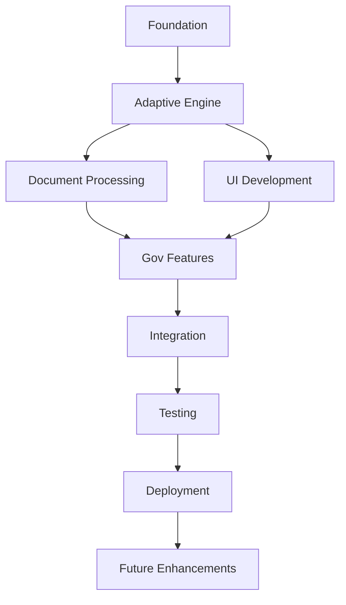

# AIKO Project Tasks - Comprehensive Overview

**Project**: AIKO (Adaptive Intelligence for Kontract Optimization)  
**Version**: 2.0.0  
**Date**: July 14, 2025  
**Status**: In Progress  

---

## 🎯 Project Vision

Build an intelligent iOS/macOS application that revolutionizes government contracting by learning from user patterns, minimizing questions, and automating document processing through adaptive AI.

---

## 📋 Master Task List

### Phase 1: Foundation & Architecture ✅

#### Task 1: Project Setup and Core Infrastructure ✅
- **1.1** Initialize SwiftUI + TCA project structure ✅
- **1.2** Configure development environment and dependencies ✅
- **1.3** Set up Core Data for persistence ✅
- **1.4** Implement TodoWrite-only task management ✅
- **1.5** Remove legacy task tracking systems ✅
- **1.6** Create comprehensive documentation structure ✅

### Phase 2: Adaptive Intelligence Engine 🚧

#### Task 2: Build Adaptive Prompting Engine with Minimal Questioning 🚧
- **2.1** Design conversational flow architecture ✅
  - Created `AdaptivePromptingEngine.swift`
  - Defined conversation states and session management
  - Implemented dynamic question generation
  
- **2.2** Implement context extraction from documents ✅
  - Created `UnifiedDocumentContextExtractor.swift`
  - Integrated Vision framework for OCR
  - Built adaptive pattern learning system
  - Implemented confidence scoring
  
- **2.3** Create user pattern learning module ✅
  - Design `UserPatternLearningEngine` ✅
    - Created comprehensive pattern learning engine with session management
    - Implemented pattern discovery and confidence tracking
    - Built smart defaults and preference retrieval
  - Implement pattern recognition algorithms ✅
    - Created `PatternRecognitionAlgorithm` with advanced pattern mining
    - Built frequent pattern mining and sequence analysis
    - Implemented temporal pattern analysis and value clustering
  - Build preference storage system ✅
    - Created `UserPreferenceStore` with Core Data persistence
    - Implemented preference caching and context matching
    - Built import/export functionality for backups
  - Create learning feedback loops ✅
    - Implemented `LearningFeedbackLoop` with multi-type processing
    - Built adaptive learning rate controller
    - Created pattern reinforcement engine
    - Added comprehensive feedback analytics
  - Build user behavior analytics ✅
    - Created `UserBehaviorAnalytics` for interaction tracking
    - Implemented performance monitoring and session tracking
    - Built privacy-aware event collection system
    - Added gesture analysis and interaction pattern detection
  
- **2.4** Build smart defaults system ✅
  - Implement field prediction based on history ✅
  - Create contextual default values ✅
  - Build confidence-based auto-fill ✅
  
- **2.5** Implement Multi-Provider LLM Integration (API Key Agnostic) ✅
  - Design LLMProviderProtocol for vendor-agnostic architecture ✅
  - Build secure API key storage using Keychain Services ✅
  - Create provider adapters (Claude, OpenAI, Google Gemini) ✅
  - Implement graceful fallback system between providers ✅
  - Build provider selection UI with capabilities display ✅
  - Create unified conversation state management ✅
  - Build context-aware document generation templates ✅
  - Add provider-specific feature handling

### Phase 3: Document Processing & Compliance Core 📅

#### Task 3: Create Historical Data Matching and Auto-population System
- **3.1** Design pattern matching algorithm to identify similar past acquisitions
- **3.2** Implement field auto-population logic based on matched patterns
- **3.3** Create learning feedback loop from user corrections
- **3.4** Build user-specific profiles for personalization
- **3.5** Add confidence scoring for auto-populated values

#### Task 4: Develop Comprehensive FAR/DFAR Rules Engine
- **4.1** Parse and structure FAR/DFAR regulations into queryable format
- **4.2** Build acquisition type mapping to applicable regulations
- **4.3** Implement documentation requirement engine
- **4.4** Create compliance validation system
- **4.5** Build regulation guidance module

#### Task 8: Implement Offline Caching System for Document Processing
- **8.1** Design and Implement Cache Storage Layer using IndexedDB
- **8.2** Develop Cache Management API with query capabilities
- **8.3** Implement Synchronization Logic with conflict resolution
- **8.4** Integrate User Experience features and security measures

### Phase 4: Form Intelligence & Automation 📅

#### Task 5: Implement Better-Auth for Government Security Compliance 🚧
- **5.1** Week 1-2: Assessment and Planning - Evaluate Better-Auth features and compliance certifications
- **5.2** Week 3-4: SDK Integration - Integrate Better-Auth API/SDK with SwiftUI/TCA architecture
- **5.3** Week 5-6: Multi-tenant & Offline Auth - Implement data isolation and offline authentication
- **5.4** Week 7-8: Security Testing & Compliance Verification - Conduct extensive testing and audits
- **5.5** Week 9-10: Finalization and Deployment - Deploy with biometric auth and MFA support
**Timeline**: 10-12 weeks | **Priority**: CRITICAL for government compliance

#### Task 6: Implement One-click Document Chain Automation
- **6.1** Design document chain workflow engine for acquisition sequences
- **6.2** Implement form generation templates for all required forms
- **6.3** Create approval point system with user-defined checkpoints
- **6.4** Build document consistency checker across generated documents
- **6.5** Add multi-format export (PDF, Word, etc.)

#### Task 9: Implement FAR/DFAR Compliance Checking Engine
- **9.1** Create Compliance Rule Database with versioning
- **9.2** Develop Rule Parser and Interpreter with domain-specific language
- **9.3** Implement Real-time Validation Engine with performance optimization
- **9.4** Build Compliance Reporting System with remediation suggestions
- **9.5** Integrate with Form Generation and offline support (including agency supplementals)

#### Task 15: Create Adaptive Form Prompting System
- **15.1** Build intelligent form assistance with context-aware help
- **15.2** Implement dynamic field suggestions based on user patterns
- **15.3** Create progressive disclosure for complex forms
- **15.4** Build smart defaults based on historical data
- **15.5** Implement confidence indicators for suggestions

#### Task 17: Implement Local Data Isolation for Multi-tenant Environments
- **17.1** Ensure complete data separation between users/organizations
- **17.2** Implement tenant-specific encryption keys
- **17.3** Build isolated storage partitions
- **17.4** Create tenant-aware caching system
- **17.5** Implement cross-tenant security auditing

### Phase 5: User Interface & Document Management 📅

#### Task 7: Create Conflict Detection and Resolution System
- **7.1** Identify conflicts between different document requirements
- **7.2** Build automated conflict detection algorithms
- **7.3** Implement resolution suggestion engine
- **7.4** Create conflict visualization interface
- **7.5** Build manual override capabilities with audit trail

#### Task 11: Develop Smart Document Preview System
- **11.1** Create preview showing how forms will look when complete
- **11.2** Implement validation highlights in preview
- **11.3** Build real-time preview updates as user fills forms
- **11.4** Add export preview in multiple formats
- **11.5** Implement print preview optimization

### Phase 6: Mobile & Platform Features 📅

#### Task 16: Build Mobile App for Field Acquisition Officers
- **16.1** Native iOS/Android app for document processing on the go
- **16.2** Implement offline-first architecture
- **16.3** Build sync mechanism for field data
- **16.4** Create mobile-optimized UI/UX
- **16.5** Implement device-specific features (camera, GPS)

#### Task 18: Create Bulk Import/Export Functionality
- **18.1** Handle large volumes of acquisition data efficiently
- **18.2** Implement batch processing algorithms
- **18.3** Build progress tracking for bulk operations
- **18.4** Create error handling and recovery
- **18.5** Implement data validation for imports

#### Task 19: Implement Role-based Access Control
- **19.1** Fine-grained permissions for different user types
- **19.2** Build role hierarchy system
- **19.3** Implement permission inheritance
- **19.4** Create role management interface
- **19.5** Build audit trail for permission changes

#### Task 20: Add Multi-language Support
- **20.1** Support for international acquisitions and users
- **20.2** Implement localization framework
- **20.3** Build translation management system
- **20.4** Create language switching interface
- **20.5** Implement RTL language support

### Phase 7: Performance & Quality 📅

#### Task 13: Add Intelligent Error Recovery
- **13.1** Gracefully handle and recover from processing failures
- **13.2** Implement retry mechanisms with exponential backoff
- **13.3** Build error classification system
- **13.4** Create user-friendly error messages
- **13.5** Implement automatic recovery strategies

#### Task 31: Implement Automated Testing Framework
- **31.1** Comprehensive test coverage for all features
- **31.2** Build unit testing infrastructure
- **31.3** Implement integration testing
- **31.4** Create end-to-end testing
- **31.5** Build performance testing suite

#### Task 12: n8n Workflow Automation (Performance-First Strategy) 🚧
> **Note**: Following a performance-first architecture to ensure enterprise-scale reliability before implementing business logic. iOS app acts as "thin client" with n8n as backend workhorse. See `/Users/J/Desktop/n8n aiko/` for detailed documentation and completed workflows.

##### Phase 1: Performance Foundation (3-6 months) - 20% Complete
- **12.1.1** Real-time API Batching (40% fewer queries) ✅
- **12.1.2** Auto Cache Invalidation (5x faster reads) ✅
- **12.1.3** Secure API Gateway - Intermediary layer between iOS and n8n 🚧
- **12.1.4** Asynchronous Fire-and-Forget Triggers - Instant UI feedback 🚧
- **12.1.5** Log Aggregation & Anomaly Detection (30% less downtime) 📅
- **12.1.6** Auto-scaling Triggers (instant scaling) 📅
- **12.1.7** DB Index Optimization (7x faster queries) 📅
- **12.1.8** Rate-limiting (99.9% uptime) 📅
- **12.1.9** Health Monitoring (80% faster recovery) 📅
- **12.1.10** Asset Preloading (60% faster loads) 📅
- **12.1.11** JWT Rotation (85ms auth time) - TO BE REPLACED BY Better-Auth 📅
- **12.1.12** Distributed Tracing (4x debug speed) 📅

##### Phase 2: Business Process Automation (Weeks 7-12) - Pending
- **12.2.1** Intelligent Requirement Intake 📅
- **12.2.2** Automated Market Research 📅
- **12.2.3** Smart Document Generation 📅
- **12.2.4** Intelligent Review Routing 📅
- **12.2.5** SAM.gov Integration 📅
- **12.2.6** Proposal Collection Management 📅
- **12.2.7** Evaluation Workflow Orchestration 📅
- **12.2.8** Award Processing Automation 📅

##### Phase 3: AI-Enhanced Intelligence (Months 4-6) - Pending
- **12.3.1** Predictive Acquisition Analytics 📅
- **12.3.2** Compliance Anomaly Detection 📅
- **12.3.3** Optimization Engine 📅
- **12.3.4** Vendor Recommendation AI 📅

#### Task 13: Advanced Search & Custom Reporting System 📅
- **13.1** Universal Search Engine Implementation
  - Build full-text search across all acquisition data fields
  - Implement search by contract number, vendor name, CAGE code, UEI
  - Create multi-field combination search with AND/OR logic
  - Add fuzzy search for partial matches and typos
  - Implement search history and suggestions
  
- **13.2** Custom Report Builder
  - Design drag-and-drop report builder interface
  - Create field selection and filtering system
  - Implement data aggregation and grouping options
  - Build calculation engine for totals, averages, trends
  - Add conditional formatting and highlighting
  
- **13.3** Quick Report Templates
  - Create user-definable report templates
  - Implement save/load functionality for custom reports
  - Build report sharing and collaboration features
  - Add report scheduling and automation
  - Create report favorites and quick access menu
  
- **13.4** Data Visualization & Export
  - Implement charts and graphs for visual reporting
  - Create dashboard widgets for key metrics
  - Build export functionality (PDF, Excel, CSV, JSON)
  - Add print-optimized layouts
  - Implement real-time data refresh
  
- **13.5** Report Intelligence & Analytics
  - Build trend analysis and forecasting
  - Implement anomaly detection in reports
  - Create comparative analysis tools
  - Add natural language report generation
  - Implement report insights and recommendations

#### Task 14: iOS-Native Workflow Orchestration & Parallel Processing 📅
- **14.1** Swift Concurrency Workflow Patterns
  - Implement WorkflowOrchestrator using Swift actors
  - Create DAG-based task execution with async/await
  - Build workflow state management using Core Data
  - Design workflow templates with Codable persistence
  - Implement background task scheduling with BGTaskScheduler
  - Create workflow progress tracking with Combine publishers
  
- **14.2** Native iOS Parallel Processing
  - Build TaskGroup-based parallel execution framework
  - Implement fan-out/fan-in using Swift concurrency
  - Create progress reporting with @Published properties
  - Design battery-efficient resource management
  - Build retry logic with exponential backoff
  - Implement iOS BackgroundTasks for long operations
  
- **14.3** Cloud-Based Document Generation (iOS-Optimized)
  - Integrate Claude API for intelligent document generation
  - Create DocumentGenerator actor for thread safety
  - Build progressive UI updates with SwiftUI
  - Implement result caching in Core Data
  - Design offline-first document queue
  - Create document preview with live updates
  
- **14.4** Progressive Document Enhancement for iOS
  - Implement streaming document updates to UI
  - Create confidence-based progressive display
  - Build document section parallelization
  - Design interrupt-and-resume for background limits
  - Implement smart caching with NSCache
  - Create document templates in SwiftUI
  
- **14.5** On-Device Intelligence (CoreML Integration)
  - Integrate CoreML for simple on-device processing
  - Build model download and update system
  - Create battery-aware processing modes
  - Implement privacy-preserving local analysis
  - Design hybrid cloud/local processing
  - Build A/B testing for model effectiveness

#### Task 15: iOS-Specific Implementation Patterns 📅
- **15.1** Swift Actor-Based Architecture
  - Create ActorSystem for concurrent operations
  - Implement MainActor UI updates
  - Build isolated state management
  - Design actor supervision patterns
  - Create actor communication protocols
  
- **15.2** Combine Framework Integration
  - Build reactive document generation pipeline
  - Implement backpressure handling
  - Create cancellable operation chains
  - Design error recovery streams
  - Build progress monitoring publishers
  
- **15.3** Background Processing Optimization
  - Implement BGProcessingTask for heavy operations
  - Create smart task scheduling
  - Build power-efficient algorithms
  - Design network-aware sync
  - Implement incremental processing
  
- **15.4** SwiftUI Performance Patterns
  - Create lazy loading views
  - Implement view model actors
  - Build efficient list rendering
  - Design responsive animations
  - Optimize state updates
  
- **15.5** CloudKit Integration for Distributed Processing
  - Implement CloudKit-based task queue
  - Create distributed state sync
  - Build conflict resolution
  - Design offline capabilities
  - Implement push notification triggers

### Phase 8: Performance & Optimization 📅

#### Task 16: Core Performance Optimization
- **16.1** Implement lazy loading strategies
- **16.2** Optimize Core Data queries
- **16.3** Build caching system
- **16.4** Implement background processing
- **16.5** Create performance monitoring

#### Task 17: Scalability Enhancements
- **17.1** Implement data partitioning
- **17.2** Build queue management system
- **17.3** Create load balancing logic
- **17.4** Implement resource optimization
- **17.5** Build horizontal scaling support

### Phase 9: Testing & Quality Assurance 📅

#### Task 18: Comprehensive Testing Suite
- **18.1** Unit tests for all components
- **18.2** Integration testing framework
- **18.3** UI/UX testing automation
- **18.4** Performance testing suite
- **18.5** Security penetration testing

#### Task 19: User Acceptance Testing
- **19.1** Beta testing program setup
- **19.2** User feedback collection system
- **19.3** A/B testing framework
- **19.4** Usability studies
- **19.5** Accessibility compliance testing

### Phase 10: Deployment & Launch 📅

#### Task 20: Production Preparation
- **20.1** App Store submission preparation
- **20.2** Enterprise deployment setup
- **20.3** Documentation finalization
- **20.4** Training material creation
- **20.5** Support system establishment

#### Task 21: Post-Launch Operations
- **21.1** Monitoring and alerting setup
- **21.2** User onboarding automation
- **21.3** Feedback loop implementation
- **21.4** Regular update schedule
- **21.5** Community building

### Phase 11: Document Management & Workflow

#### Task 24: Build Document Workflow Automation
- **24.1** Create customizable workflows for document approval and routing
- **24.2** Implement workflow designer interface
- **24.3** Build conditional routing logic
- **24.4** Create workflow templates library
- **24.5** Implement parallel approval paths

#### Task 25: Implement Document Analytics Dashboard
- **25.1** Show insights on document usage, completion times, and common issues
- **25.2** Create real-time metrics visualization
- **25.3** Build trend analysis reports
- **25.4** Implement bottleneck identification
- **25.5** Create predictive analytics for processing times

#### Task 29: Add Document Template Marketplace
- **29.1** Allow users to share and download document templates
- **29.2** Implement template rating system
- **29.3** Build template categorization
- **29.4** Create template versioning
- **29.5** Implement template customization tools

#### Task 32: Create Document Audit Trail System
- **32.1** Track all actions taken on documents for compliance
- **32.2** Implement tamper-proof logging
- **32.3** Create audit report generation
- **32.4** Build compliance verification tools
- **32.5** Implement retention policies

#### Task 36: Implement Document Archival System
- **36.1** Long-term storage with retrieval capabilities
- **36.2** Implement compression strategies
- **36.3** Build indexed search for archives
- **36.4** Create retention policy engine
- **36.5** Implement archive restoration tools

#### Task 42: Add Document Migration Tools
- **42.1** Import documents from legacy systems
- **42.2** Build format conversion engine
- **42.3** Implement batch import capabilities
- **42.4** Create mapping configuration tools
- **42.5** Build validation and error reporting

### Phase 12: Security & Compliance

#### Task 26: Build Automated Compliance Reporting
- **26.1** Generate reports showing regulatory compliance status
- **26.2** Implement FAR/DFAR compliance tracking
- **26.3** Create compliance dashboards
- **26.4** Build alert system for violations
- **26.5** Implement remediation tracking

#### Task 27: Implement Data Encryption at Rest
- **27.1** Secure all stored acquisition data
- **27.2** Implement key management system
- **27.3** Build encryption rotation policies
- **27.4** Create encrypted backup system
- **27.5** Implement field-level encryption

#### Task 28: Create User Activity Logging
- **28.1** Track all user actions for security auditing
- **28.2** Implement session recording
- **28.3** Build anomaly detection
- **28.4** Create activity reports
- **28.5** Implement SIEM integration

#### Task 49: Perform Security Audit and Penetration Testing
- **49.1** Comprehensive security assessment
- **49.2** Vulnerability scanning
- **49.3** Penetration testing execution
- **49.4** Security report generation
- **49.5** Remediation implementation

### Phase 13: Integration & API Development

#### Task 30: Build API for Third-party Integrations
- **30.1** RESTful API for external system connections
- **30.2** Implement authentication system
- **30.3** Build rate limiting
- **30.4** Create API documentation
- **30.5** Implement webhook system

#### Task 31: Implement Automated Testing Framework
- **31.1** Comprehensive test coverage for all features
- **31.2** Build unit testing infrastructure
- **31.3** Implement integration testing
- **31.4** Create end-to-end testing
- **31.5** Build performance testing suite

### Phase 14: User Experience Enhancements

#### Task 33: Create Training Mode for New Users
- **33.1** Interactive tutorials and practice environment
- **33.2** Build guided walkthroughs
- **33.3** Create sandbox environment
- **33.4** Implement progress tracking
- **33.5** Build certification system

#### Task 34: Add Advanced Search Capabilities
- **34.1** Full-text search across all documents
- **34.2** Implement faceted search
- **34.3** Build search filters
- **34.4** Create saved searches
- **34.5** Implement search analytics

#### Task 35: Implement Notification System
- **35.1** Email/SMS alerts for important events
- **35.2** Build notification preferences
- **35.3** Implement real-time notifications
- **35.4** Create notification templates
- **35.5** Build notification history

#### Task 43: Create Custom Branding Options
- **43.1** White-label support for agencies
- **43.2** Implement theme customization
- **43.3** Build logo management
- **43.4** Create custom color schemes
- **43.5** Implement custom domain support

#### Task 22: FAR Threshold Management System
- **22.1** Implement user-editable FAR threshold settings interface
- **22.2** Create threshold profiles for CONUS, OCONUS, Emergency, and Contingency acquisitions
- **22.3** Build threshold validation engine for acquisition workflows
- **22.4** Implement threshold change audit trail and version control
- **22.5** Create visual threshold indicators and warnings throughout workflow

#### Task 23: Escape Clause Detection System
- **23.1** Build AI-powered escape clause detection in vendor submissions
- **23.2** Implement clause categorization (termination, limitation of liability, etc.)
- **23.3** Create risk scoring for identified escape clauses
- **23.4** Build clause highlighting and annotation interface
- **23.5** Implement clause negotiation tracking and resolution workflow

### Phase 15: Data Management & Reporting

#### Task 37: Build Report Generation Engine
- **37.1** Custom reports for compliance and analytics
- **37.2** Implement report designer
- **37.3** Build scheduled reports
- **37.4** Create report distribution
- **37.5** Implement report caching

#### Task 38: Create Data Backup and Recovery
- **38.1** Automated backups with point-in-time recovery
- **38.2** Implement incremental backups
- **38.3** Build disaster recovery
- **38.4** Create backup verification
- **38.5** Implement geo-redundancy

#### Task 39: Add Electronic Signature Support
- **39.1** Legally binding digital signatures
- **39.2** Implement signature workflows
- **39.3** Build certificate management
- **39.4** Create signature validation
- **39.5** Implement audit trails

#### Task 40: Implement Change Tracking
- **40.1** Monitor all modifications to acquisition data
- **40.2** Build version comparison
- **40.3** Implement rollback capabilities
- **40.4** Create change notifications
- **40.5** Build change analytics

#### Task 41: Build Performance Monitoring
- **41.1** Real-time system health metrics
- **41.2** Implement application monitoring
- **41.3** Build performance dashboards
- **41.4** Create alert system
- **41.5** Implement SLA tracking

### Phase 16: Future Enhancements

#### Task 50: Raindrop (liquid.ai) Integration - Future Enhancement 📅
> **Note**: Implement after core adaptive engine (Tasks 2.3-2.5) is complete. Provides continuous learning without app updates.

- **50.1** Phase 1 (Weeks 1-4): On-device LNN prototype - Validate real-time adaptation and privacy compliance
- **50.2** Phase 2 (Weeks 5-8): Hybrid deployment - On-device inference + cloud federated learning
- **50.3** Phase 3 (Weeks 9-12): Full integration - Replace static DNNs with LNNs where beneficial
- **50.4** Implement OTA model sync for seamless updates without app store releases
- **50.5** Create performance benchmarks - Test on iPhone 14+ and M1 Mac
**Timeline**: 12 weeks | **Priority**: LOW - Future enhancement after core features

#### Task 51: Advanced AI Features
- **51.1** Multi-modal document understanding
- **51.2** Predictive contract analysis
- **51.3** Natural language contract generation
- **51.4** Intelligent negotiation assistant
- **51.5** Automated compliance monitoring

---

## 📊 Progress Overview

### Total Tasks: 51 Main Tasks (255 Subtasks)

### Completed Tasks: 16/255 (6.3%)
- ✅ Tasks 1.1-1.6 (Foundation)
- ✅ Tasks 2.1-2.3 (Adaptive Engine core components)
- ✅ Task 2.4 (Smart Defaults System)
- ✅ Task 2.5 (Multi-Provider LLM Integration)

### In Progress: 0/255 (0%)

### Pending: 239/255 (93.7%)
- 📅 Remaining tasks across all phases

### Migrated from TaskMaster.ai: 40 Tasks
- Successfully migrated Tasks 3-11, 13, 15-43, 49 from legacy system
- All tasks now managed exclusively in TodoWrite

---

## 🎯 Current Sprint Focus

**Sprint**: Adaptive Intelligence Foundation + Critical Security  
**Duration**: 2-4 weeks  
**Goals**:
1. ✅ Complete Task 2.3: User Pattern Learning Module - **DONE**
2. ✅ Complete Task 2.4: Smart Defaults System - **DONE**
3. ✅ Complete Task 2.5: Multi-Provider LLM Integration - **DONE**
4. **CRITICAL**: Start Task 5: Better-Auth Implementation for Government Compliance - **NEXT PRIORITY**

## 🔐 Critical Integration Priorities (Based on VanillaIce Consensus)

1. **Better-Auth** (10-12 weeks) - **IMMEDIATE PRIORITY**
   - Required for government security compliance (FISMA, FedRAMP, NIST)
   - Replaces current JWT rotation with secure token management
   - Enables biometric auth, multi-tenant isolation, offline-first

2. **n8n Workflows** (Phase 1: 3-6 months) - **ONGOING**
   - Continue performance foundation (8 workflows remaining)
   - iOS as "thin client", n8n as backend workhorse
   - API Gateway and async triggers are next priorities

3. **Raindrop LNN** (12 weeks) - **FUTURE ENHANCEMENT**
   - Implement after core adaptive engine is complete
   - Provides continuous learning without app updates
   - Hybrid on-device/cloud approach with federated learning

---

## 📈 Milestones

1. **Milestone 1**: Core Adaptive Engine (Tasks 1-2) - August 2025
2. **Milestone 2**: Document Processing (Tasks 3-4) - September 2025
3. **Milestone 3**: Beta UI Release (Tasks 5-6) - October 2025
4. **Milestone 4**: Gov Features (Tasks 7-8) - November 2025
5. **Milestone 5**: Production Launch (Tasks 18-21) - January 2026

---

## 🔄 Task Dependencies

---

## 📝 Notes

- Tasks are estimated at high level and may be broken down further
- Priority may shift based on user feedback and market needs
- Integration tasks depend on external API availability
- Some tasks may run in parallel to optimize timeline

---

**Last Updated**: January 15, 2025  
**Next Review**: January 29, 2025  
**Task Migration**: Completed migration of 40 tasks from TaskMaster.ai
