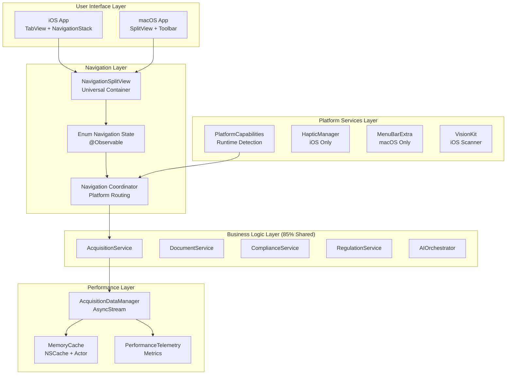

# PHASE 4: Platform Optimization - Technical Design Document
## AIKO v6.0 - Cross-Platform Government Contracting Productivity Tool

**Version:** 2.0  
**Date:** 2025-08-03  
**Phase:** Technical Design & Architecture  
**Author:** Design Architect Agent  
**Status:** COMPLETE - Ready for TDD Implementation  
**Research ID:** R-001-phase4_productivity_platform_optimization  
**PRD Status:** ✅ APPROVED - VanillaIce Consensus Validated

---

## Executive Summary

This technical design document provides the comprehensive implementation blueprint for PHASE 4 Platform Optimization of AIKO v6.0. Building upon the validated PRD and research findings, this design implements NavigationSplitView as the foundational navigation architecture with platform-conditional optimizations that deliver native experiences on both iOS and macOS while achieving 85% code reuse.

### Key Design Decisions
- **NavigationSplitView Foundation**: Universal navigation container with platform adaptations
- **Enum-Driven Navigation State**: Type-safe, testable navigation management
- **Platform-Conditional UI**: iOS TabView for mobile, macOS Toolbar for desktop productivity
- **Performance Architecture**: Batch loading, memory caching, cooperative multitasking
- **Clean Architecture**: Shared business logic (85%), platform-specific UI (15%)

### Implementation Timeline
- **Week 1**: Navigation foundation and enum-driven state (5 days)
- **Week 2**: Platform-specific UI implementations (5 days)
- **Week 3**: Performance optimizations and testing (5 days)
- **Buffer**: 20% contingency (3-4 days recommended)

---

## 1. Architecture Design

### 1.1 High-Level Architecture



### 1.2 Component Architecture

#### Navigation Architecture
```swift
// Core navigation components relationship
NavigationSplitView (Container)
    ├── NavigationState (@Observable)
    │   ├── NavigationDestination (Enum)
    │   ├── WorkflowType (Enum)
    │   └── Platform-specific state
    ├── NavigationCoordinator (Router)
    │   ├── Platform detection
    │   ├── Route handling
    │   └── Deep linking
    └── PlatformCapabilities (Detector)
        ├── Device capabilities
        ├── Feature availability
        └── UI adaptations
```

#### Data Flow Architecture
```swift
// Unidirectional data flow
User Action → NavigationState → Service Layer → Data Manager → UI Update
                    ↓                              ↓
              Telemetry ←────────────────── Performance Metrics
```

### 1.3 Module Dependencies

```yaml
AIKO (Main App):
  dependencies:
    - AIKOCore
    - AIKOPlatforms
    
AIKOCore (Business Logic):
  dependencies:
    - SwiftAnthropic
    - Collections
    - MultipartKit
  exports:
    - Navigation
    - Services
    - ViewModels
    - Models
    
AIKOPlatforms (Platform Services):
  dependencies:
    - AIKOCore
  exports:
    - iOS Services
    - macOS Services
    - Platform Detection
```

---

## 2. Core Navigation Implementation

### 2.1 NavigationSplitView Architecture

```swift
// ContentView.swift - Universal navigation container
import SwiftUI

public struct ContentView: View {
    @State private var navigationState = NavigationState()
    @Environment(\.horizontalSizeClass) var sizeClass
    @Environment(\.platformCapabilities) var platform
    
    public var body: some View {
        Group {
            if platform.recommendedNavigation == .tabView {
                // iPhone compact mode
                iOSTabView(navigationState: navigationState)
            } else {
                // iPad and macOS split view
                universalSplitView
            }
        }
        .environment(navigationState)
        .task {
            await navigationState.initialize()
        }
    }
    
    @ViewBuilder
    private var universalSplitView: some View {
        NavigationSplitView(
            columnVisibility: $navigationState.columnVisibility,
            sidebar: { sidebarContent },
            content: { contentList },
            detail: { detailView }
        )
        .navigationSplitViewStyle(.automatic)
        #if os(macOS)
        .frame(minWidth: 1000, minHeight: 700)
        .toolbar { macOSProductivityToolbar }
        #endif
    }
}
```

### 2.2 Enum-Driven Navigation State Design

```swift
// NavigationState.swift - Complete implementation
import SwiftUI
import Observation

@Observable
public final class NavigationState: @unchecked Sendable {
    // MARK: - Navigation Types
    public enum NavigationDestination: Hashable, Codable {
        case acquisition(AcquisitionID)
        case document(DocumentID)
        case compliance(ComplianceCheckID)
        case search(SearchContext)
        case settings(SettingsSection)
        case quickAction(QuickActionType)
        case workflow(WorkflowStep)
        
        // Deep linking support
        var deepLinkPath: String {
            switch self {
            case .acquisition(let id): return "acquisition/\(id)"
            case .document(let id): return "document/\(id)"
            case .compliance(let id): return "compliance/\(id)"
            case .search(let context): return "search?q=\(context.query)"
            case .settings(let section): return "settings/\(section.rawValue)"
            case .quickAction(let type): return "action/\(type.rawValue)"
            case .workflow(let step): return "workflow/\(step.id)"
            }
        }
    }
    
    // MARK: - State Management
    private let coordinator = NavigationCoordinator.shared
    private let telemetry = PerformanceTelemetry.shared
    
    // Navigation state
    public var columnVisibility: NavigationSplitViewVisibility = .automatic
    public var selectedAcquisition: AcquisitionID?
    public var detailPath = NavigationPath()
    public var navigationHistory: [NavigationDestination] = []
    
    // Workflow state
    public var activeWorkflow: WorkflowType?
    public var workflowProgress: WorkflowProgress = .notStarted
    
    // Platform-specific state
    #if os(iOS)
    public var selectedTab: Tab = .dashboard
    public var sheetPresentation: SheetPresentation?
    #else
    public var activeWindows: Set<WindowID> = []
    public var toolbarState = ToolbarState()
    #endif
    
    // MARK: - Navigation Methods
    public func navigate(to destination: NavigationDestination) async {
        let navigationId = UUID()
        let startTime = CFAbsoluteTimeGetCurrent()
        
        await telemetry.startNavigation(id: navigationId, destination: destination)
        
        // Update history
        navigationHistory.append(destination)
        if navigationHistory.count > 50 {
            navigationHistory.removeFirst()
        }
        
        // Platform-specific navigation
        await coordinator.performNavigation(destination, state: self)
        
        // Update selection state
        switch destination {
        case .acquisition(let id):
            selectedAcquisition = id
        default:
            break
        }
        
        // Update detail path
        detailPath.append(destination)
        
        let duration = CFAbsoluteTimeGetCurrent() - startTime
        await telemetry.completeNavigation(id: navigationId, duration: duration)
    }
    
    // MARK: - Workflow Management
    public func startWorkflow(_ type: WorkflowType) async {
        activeWorkflow = type
        workflowProgress = .inProgress(step: 0, of: type.totalSteps)
        
        if let firstDestination = type.firstDestination {
            await navigate(to: firstDestination)
        }
    }
    
    public func advanceWorkflow() async {
        guard let workflow = activeWorkflow else { return }
        
        switch workflowProgress {
        case .inProgress(let step, let total):
            let nextStep = step + 1
            if nextStep >= total {
                workflowProgress = .completed
                activeWorkflow = nil
            } else {
                workflowProgress = .inProgress(step: nextStep, of: total)
                if let destination = workflow.destination(for: nextStep) {
                    await navigate(to: destination)
                }
            }
        default:
            break
        }
    }
}

// MARK: - Supporting Types
public enum WorkflowProgress: Equatable {
    case notStarted
    case inProgress(step: Int, of: Int)
    case completed
    case failed(Error)
    
    public static func == (lhs: WorkflowProgress, rhs: WorkflowProgress) -> Bool {
        switch (lhs, rhs) {
        case (.notStarted, .notStarted), (.completed, .completed):
            return true
        case (.inProgress(let l1, let l2), .inProgress(let r1, let r2)):
            return l1 == r1 && l2 == r2
        case (.failed, .failed):
            return true
        default:
            return false
        }
    }
}
```

### 2.3 Navigation Coordinator Pattern

```swift
// NavigationCoordinator.swift - Platform-specific routing
import SwiftUI

@MainActor
public final class NavigationCoordinator {
    public static let shared = NavigationCoordinator()
    
    public func performNavigation(
        _ destination: NavigationState.NavigationDestination,
        state: NavigationState
    ) async {
        #if os(iOS)
        await performIOSNavigation(destination, state: state)
        #else
        await performMacOSNavigation(destination, state: state)
        #endif
    }
    
    #if os(iOS)
    private func performIOSNavigation(
        _ destination: NavigationState.NavigationDestination,
        state: NavigationState
    ) async {
        // Determine if we need to switch tabs
        let targetTab = tabForDestination(destination)
        if state.selectedTab != targetTab {
            state.selectedTab = targetTab
            // Allow tab animation to complete
            try? await Task.sleep(nanoseconds: 200_000_000)
        }
        
        // Handle sheet presentations for certain destinations
        switch destination {
        case .quickAction(.scanDocument):
            state.sheetPresentation = .documentScanner
        case .settings:
            state.sheetPresentation = .settings
        default:
            // Regular navigation
            break
        }
    }
    
    private func tabForDestination(_ destination: NavigationState.NavigationDestination) -> Tab {
        switch destination {
        case .acquisition, .compliance:
            return .dashboard
        case .document:
            return .documents
        case .search:
            return .search
        case .quickAction:
            return .actions
        case .settings:
            return .settings
        case .workflow:
            return .dashboard
        }
    }
    #endif
    
    #if os(macOS)
    private func performMacOSNavigation(
        _ destination: NavigationState.NavigationDestination,
        state: NavigationState
    ) async {
        // Check if we need a new window
        switch destination {
        case .document(let id) where state.toolbarState.openInNewWindow:
            await openDocumentInNewWindow(id)
        case .compliance(let id) where state.activeWindows.count > 0:
            // Open in existing compliance window if available
            if let window = findWindow(type: .compliance) {
                await updateWindow(window, with: destination)
            } else {
                await openComplianceInNewWindow(id)
            }
        default:
            // Regular navigation in main window
            break
        }
    }
    #endif
}
```

---

## 3. Platform-Specific Implementations

### 3.1 iOS Implementation Architecture

```swift
// iOS Navigation Structure
struct iOSNavigationArchitecture {
    // Tab-based navigation for iPhone
    TabView {
        Dashboard
        Documents  
        Search
        Actions
        Settings
    }
    
    // NavigationStack for linear workflows
    NavigationStack {
        ListView
        DetailView
        ActionView
    }
    
    // Sheet presentations for modals
    Sheet {
        DocumentScanner
        Filters
        QuickActions
    }
}
```

#### iOS Touch Optimization Strategy
```swift
// Touch target optimization
struct TouchOptimizationStrategy {
    static let minimumTapTarget: CGFloat = 44 // Apple HIG
    static let recommendedTapTarget: CGFloat = 60 // AIKO enhanced
    static let listRowMinHeight: CGFloat = 80 // Comfortable touch
    static let buttonPadding = EdgeInsets(top: 12, leading: 16, bottom: 12, trailing: 16)
}

// Implementation example
struct OptimizedButton: View {
    let title: String
    let action: () -> Void
    
    var body: some View {
        Button(action: action) {
            Text(title)
                .frame(maxWidth: .infinity)
                .frame(minHeight: TouchOptimizationStrategy.recommendedTapTarget)
                .contentShape(Rectangle()) // Expand hit area
        }
        .buttonStyle(TouchFeedbackStyle())
    }
}
```

### 3.2 macOS Implementation Architecture

```swift
// macOS Productivity Features
struct macOSProductivityArchitecture {
    // Toolbar with acquisition actions
    Toolbar {
        NewAcquisition
        GenerateDocuments
        CheckCompliance
        SearchRegulations
    }
    
    // MenuBarExtra for persistent access
    MenuBarExtra {
        RecentAcquisitions
        ActiveWorkflows
        QuickActions
    }
    
    // Multi-window support
    WindowGroup {
        MainWindow
        DocumentComparison
        ComplianceReview
    }
    
    // Keyboard shortcuts
    KeyboardShortcuts {
        Cmd+N: NewAcquisition
        Cmd+G: GenerateDocument
        Cmd+K: CheckCompliance
        Cmd+F: SearchRegulations
    }
}
```

#### macOS Window Management
```swift
// Window management strategy
actor WindowManager {
    private var windows: [WindowID: NSWindow] = [:]
    
    func openWindow(type: WindowType, content: AnyView) async {
        let window = NSWindow(
            contentRect: type.defaultFrame,
            styleMask: type.styleMask,
            backing: .buffered,
            defer: false
        )
        
        window.title = type.title
        window.setFrameAutosaveName(type.identifier)
        window.contentView = NSHostingView(rootView: content)
        
        windows[type.id] = window
        window.makeKeyAndOrderFront(nil)
    }
    
    func findWindow(type: WindowType) -> NSWindow? {
        windows.values.first { $0.title == type.title }
    }
}

enum WindowType {
    case main
    case documentComparison
    case complianceReview
    case regulationSearch
    
    var defaultFrame: NSRect {
        switch self {
        case .main:
            return NSRect(x: 0, y: 0, width: 1200, height: 800)
        case .documentComparison:
            return NSRect(x: 0, y: 0, width: 1400, height: 900)
        case .complianceReview:
            return NSRect(x: 0, y: 0, width: 1000, height: 700)
        case .regulationSearch:
            return NSRect(x: 0, y: 0, width: 800, height: 600)
        }
    }
}
```

### 3.3 Conditional Compilation Strategy

```swift
// Platform-specific view implementations
struct PlatformAdaptiveView: View {
    @Environment(\.platformCapabilities) var platform
    
    var body: some View {
        #if os(iOS)
        iOSLayout
        #else
        macOSLayout
        #endif
    }
    
    // Shared business logic
    private func performAction() async {
        // Same logic for both platforms
        await acquisitionService.createAcquisition()
    }
    
    // Platform-specific UI
    #if os(iOS)
    private var iOSLayout: some View {
        VStack {
            // Touch-optimized layout
        }
    }
    #endif
    
    #if os(macOS)
    private var macOSLayout: some View {
        HSplitView {
            // Desktop-optimized layout
        }
    }
    #endif
}
```

---

## 4. Performance Architecture

### 4.1 Data Loading Strategy

```swift
// Batch loading architecture
actor BatchLoadingArchitecture {
    // Configuration
    struct LoadingConfiguration {
        let batchSize = 50
        let prefetchThreshold = 10
        let maxConcurrentLoads = 3
        let cacheSize = 200
        let cacheTTL: TimeInterval = 300 // 5 minutes
    }
    
    // AsyncStream for progressive loading
    func loadAcquisitions() -> AsyncStream<LoadResult> {
        AsyncStream { continuation in
            Task {
                var offset = 0
                let config = LoadingConfiguration()
                
                while true {
                    // Check cache first
                    if let cached = await checkCache(offset: offset) {
                        continuation.yield(.cached(cached))
                        offset += cached.count
                        continue
                    }
                    
                    // Load from database
                    let batch = await loadBatch(
                        offset: offset,
                        limit: config.batchSize
                    )
                    
                    if batch.isEmpty {
                        continuation.finish()
                        break
                    }
                    
                    // Cache results
                    await cache(batch, offset: offset)
                    
                    continuation.yield(.loaded(batch))
                    offset += batch.count
                    
                    // Cooperative multitasking
                    if offset.isMultiple(of: 200) {
                        await Task.yield()
                    }
                }
            }
        }
    }
}

enum LoadResult {
    case cached([Acquisition])
    case loaded([Acquisition])
    case error(Error)
}
```

### 4.2 Memory Management Architecture

```swift
// Memory-efficient caching system
actor MemoryManagementArchitecture {
    private let cache = NSCache<NSString, CacheEntry>()
    private let memoryWarningObserver: NSObjectProtocol
    
    init() {
        // Configure cache limits
        cache.countLimit = 100
        cache.totalCostLimit = 50_000_000 // 50MB
        
        // Monitor memory warnings
        memoryWarningObserver = NotificationCenter.default.addObserver(
            forName: UIApplication.didReceiveMemoryWarningNotification,
            object: nil,
            queue: .main
        ) { [weak self] _ in
            Task {
                await self?.handleMemoryWarning()
            }
        }
    }
    
    private func handleMemoryWarning() async {
        // Progressive cache eviction
        cache.removeAllObjects()
        await telemetry.recordMemoryWarning()
    }
    
    func cacheValue<T>(_ value: T, key: String, cost: Int) async {
        let entry = CacheEntry(
            value: value,
            timestamp: Date(),
            accessCount: 0
        )
        
        cache.setObject(
            entry,
            forKey: key as NSString,
            cost: cost
        )
    }
}

// LRU eviction policy
extension NSCache {
    func evictLeastRecentlyUsed(count: Int) {
        // Implementation of LRU eviction
    }
}
```

### 4.3 Performance Monitoring Architecture

```swift
// Comprehensive performance tracking
actor PerformanceMonitoringArchitecture {
    struct MetricsConfiguration {
        let samplingRate: Double = 0.1 // 10% sampling
        let batchSize = 100
        let uploadInterval: TimeInterval = 300 // 5 minutes
    }
    
    private var metrics: [PerformanceMetric] = []
    private let config = MetricsConfiguration()
    
    func recordMetric(_ metric: PerformanceMetric) async {
        // Sampling decision
        guard Double.random(in: 0...1) <= config.samplingRate else { return }
        
        metrics.append(metric)
        
        // Batch upload when threshold reached
        if metrics.count >= config.batchSize {
            await uploadMetrics()
        }
    }
    
    func trackNavigationPerformance() async -> NavigationPerformanceTracker {
        NavigationPerformanceTracker { duration, destination in
            await self.recordMetric(
                PerformanceMetric(
                    type: .navigation,
                    name: "navigation_duration",
                    value: duration,
                    metadata: ["destination": destination]
                )
            )
        }
    }
}

// Performance tracking wrapper
struct NavigationPerformanceTracker {
    let completion: (TimeInterval, String) async -> Void
    private let startTime = CFAbsoluteTimeGetCurrent()
    
    func complete(destination: String) async {
        let duration = CFAbsoluteTimeGetCurrent() - startTime
        await completion(duration, destination)
    }
}
```

---

## 5. Implementation Sequence

### 5.1 Week 1: Navigation Foundation (Days 1-5)

```yaml
Day 1 - NavigationSplitView Setup:
  Morning:
    - Create ContentView with NavigationSplitView
    - Implement basic three-column layout
    - Add platform detection logic
  Afternoon:
    - Create sidebar navigation structure
    - Implement content list view
    - Add detail view container
    
Day 2 - Enum-Driven State:
  Morning:
    - Implement NavigationState class
    - Create NavigationDestination enum
    - Add WorkflowType enum
  Afternoon:
    - Implement navigation methods
    - Add state persistence
    - Create navigation history
    
Day 3 - Platform Detection:
  Morning:
    - Create PlatformCapabilities struct
    - Implement device detection
    - Add feature flags
  Afternoon:
    - Create NavigationCoordinator
    - Implement platform routing
    - Add deep linking support
    
Day 4 - View Migration:
  Morning:
    - Migrate AcquisitionListView
    - Migrate DocumentDetailView
    - Migrate ComplianceView
  Afternoon:
    - Update ViewModels for new navigation
    - Add navigation bindings
    - Test navigation flows
    
Day 5 - Testing & Documentation:
  Morning:
    - Write NavigationState tests
    - Test platform detection
    - Verify navigation flows
  Afternoon:
    - Update architecture documentation
    - Create migration guide
    - Code review preparation
```

### 5.2 Week 2: Platform UI (Days 6-10)

```yaml
Day 6-7 - iOS Implementation:
  - Implement TabView structure
  - Create touch-optimized components
  - Add haptic feedback
  - Implement sheet presentations
  - Test on various iOS devices
  
Day 8-9 - macOS Implementation:
  - Create toolbar integration
  - Implement MenuBarExtra
  - Add keyboard shortcuts
  - Create multi-window support
  - Test on macOS versions
  
Day 10 - Cross-Platform Testing:
  - Verify feature parity
  - Test navigation consistency
  - Validate UI adaptations
  - Performance benchmarking
```

### 5.3 Week 3: Performance & Polish (Days 11-15)

```yaml
Day 11-12 - Performance Implementation:
  - Implement batch loading
  - Create memory cache
  - Add telemetry system
  - Optimize navigation transitions
  
Day 13-14 - Testing & Validation:
  - Performance testing suite
  - Load testing with large datasets
  - Memory usage profiling
  - User acceptance testing
  
Day 15 - Final Integration:
  - Bug fixes and polish
  - Documentation updates
  - Release preparation
  - Rollout planning
```

---

## 6. Migration Strategy

### 6.1 Feature Flag Implementation

```swift
// Gradual rollout configuration
struct Phase4FeatureFlags {
    // Core navigation flags
    @AppStorage("phase4.navigationSplitView") var useNavigationSplitView = false
    @AppStorage("phase4.enumNavigation") var useEnumNavigation = false
    
    // Platform-specific flags
    @AppStorage("phase4.iosTabView") var useIOSTabView = false
    @AppStorage("phase4.macosToolbar") var useMacOSToolbar = false
    @AppStorage("phase4.menuBarExtra") var useMenuBarExtra = false
    
    // Performance flags
    @AppStorage("phase4.batchLoading") var useBatchLoading = false
    @AppStorage("phase4.memoryCache") var useMemoryCache = false
    @AppStorage("phase4.telemetry") var useTelemetry = false
    
    // Rollout control
    @AppStorage("phase4.rolloutPercentage") var rolloutPercentage = 0
    @AppStorage("phase4.enabledUsers") var enabledUsers: Set<String> = []
}
```

### 6.2 Migration Phases

```swift
// Three-phase migration plan
enum MigrationPhase {
    case alpha  // Internal testing (5% users)
    case beta   // Limited rollout (25% users)
    case ga     // General availability (100% users)
    
    var configuration: MigrationConfiguration {
        switch self {
        case .alpha:
            return MigrationConfiguration(
                percentage: 5,
                features: [.navigationSplitView, .enumNavigation],
                monitoring: .verbose
            )
        case .beta:
            return MigrationConfiguration(
                percentage: 25,
                features: [.all],
                monitoring: .standard
            )
        case .ga:
            return MigrationConfiguration(
                percentage: 100,
                features: [.all],
                monitoring: .production
            )
        }
    }
}
```

### 6.3 Rollback Strategy

```swift
// Emergency rollback mechanism
actor RollbackManager {
    func executeRollback(reason: RollbackReason) async {
        // 1. Disable all feature flags
        await disableAllPhase4Features()
        
        // 2. Notify users
        await notifyUsersOfRollback(reason: reason)
        
        // 3. Log rollback event
        await telemetry.logRollback(reason: reason)
        
        // 4. Revert to legacy navigation
        await revertToLegacyNavigation()
    }
    
    func canRollback() -> Bool {
        // Check if rollback is possible
        return !hasIrreversibleChanges()
    }
}
```

---

## 7. Testing Strategy

### 7.1 Test Architecture

```yaml
Test Categories:
  Unit Tests:
    - NavigationState logic
    - Platform detection
    - Data loading
    - Cache management
    
  Integration Tests:
    - Navigation flows
    - Platform transitions
    - Service integration
    - Performance metrics
    
  UI Tests:
    - Touch targets (iOS)
    - Keyboard navigation (macOS)
    - Cross-platform consistency
    - Accessibility
    
  Performance Tests:
    - Navigation speed
    - Memory usage
    - Batch loading
    - Cache efficiency
```

### 7.2 Test Implementation Examples

```swift
// Navigation state testing
class NavigationStateTests: XCTestCase {
    @MainActor
    func testEnumDrivenNavigation() async {
        let state = NavigationState()
        let destination = NavigationState.NavigationDestination.acquisition("ACQ-001")
        
        await state.navigate(to: destination)
        
        XCTAssertEqual(state.selectedAcquisition, "ACQ-001")
        XCTAssertEqual(state.navigationHistory.last, destination)
        XCTAssertFalse(state.detailPath.isEmpty)
    }
    
    func testWorkflowProgression() async {
        let state = NavigationState()
        await state.startWorkflow(.documentGeneration)
        
        XCTAssertEqual(state.activeWorkflow, .documentGeneration)
        XCTAssertEqual(state.workflowProgress, .inProgress(step: 0, of: 3))
        
        await state.advanceWorkflow()
        XCTAssertEqual(state.workflowProgress, .inProgress(step: 1, of: 3))
    }
}

// Platform-specific testing
#if os(iOS)
class iOSOptimizationTests: XCTestCase {
    func testMinimumTouchTargets() throws {
        let card = TouchOptimizedAcquisitionCard(
            acquisition: .sample,
            onTap: {}
        )
        
        let view = try card.inspect()
        let frame = try view.frame()
        
        XCTAssertGreaterThanOrEqual(frame.height, 44)
    }
}
#endif

// Performance testing
class PerformanceTests: XCTestCase {
    func testBatchLoadingPerformance() async {
        measure {
            let expectation = expectation(description: "Load 1000 items")
            Task {
                let manager = AcquisitionDataManager()
                var count = 0
                
                for await batch in manager.loadAcquisitions() {
                    count += batch.count
                    if count >= 1000 {
                        expectation.fulfill()
                        break
                    }
                }
            }
            wait(for: [expectation], timeout: 2.0)
        }
    }
}
```

### 7.3 Test Coverage Requirements

```yaml
Coverage Targets:
  NavigationState: 95%
  Platform Detection: 90%
  UI Components: 85%
  Services: 90%
  Performance: 80%
  Overall: 90%
```

---

## 8. Risk Analysis & Mitigation

### 8.1 Technical Risks

| Risk | Impact | Probability | Mitigation |
|------|--------|-------------|------------|
| NavigationSplitView complexity | High | Medium | Incremental migration, thorough testing |
| Platform divergence | Medium | High | Strict shared logic boundaries |
| Performance regression | High | Low | Continuous monitoring, rollback plan |
| Memory issues with caching | Medium | Medium | Memory pressure handling, limits |
| Breaking existing workflows | High | Low | Feature flags, A/B testing |

### 8.2 Mitigation Implementation

```swift
// Risk mitigation patterns
struct RiskMitigation {
    // Performance monitoring
    static func monitorPerformance() async -> PerformanceReport {
        let navigation = await measureNavigationPerformance()
        let memory = await measureMemoryUsage()
        let responsiveness = await measureUIResponsiveness()
        
        return PerformanceReport(
            navigation: navigation,
            memory: memory,
            responsiveness: responsiveness,
            timestamp: Date()
        )
    }
    
    // Automatic rollback triggers
    static func checkRollbackTriggers(_ report: PerformanceReport) -> Bool {
        let triggers = [
            report.navigation.p95 > 200, // >200ms navigation
            report.memory.peak > 300_000_000, // >300MB memory
            report.responsiveness.frameDrops > 10 // >10 dropped frames
        ]
        
        return triggers.contains(true)
    }
}
```

---

## 9. Documentation Requirements

### 9.1 Technical Documentation

```markdown
Required Documentation:
1. Architecture Overview
   - System design diagrams
   - Component relationships
   - Data flow documentation

2. API Documentation
   - NavigationState API
   - Platform services API
   - Performance monitoring API

3. Migration Guide
   - Step-by-step migration
   - Feature flag configuration
   - Rollback procedures

4. Testing Guide
   - Test suite structure
   - Performance benchmarks
   - Platform-specific tests
```

### 9.2 User Documentation

```markdown
User-Facing Documentation:
1. Platform Feature Guide
   - iOS navigation patterns
   - macOS productivity features
   - Keyboard shortcuts

2. Performance Tips
   - Optimal usage patterns
   - Troubleshooting guide
   - FAQ section

3. Release Notes
   - New features
   - Improvements
   - Known issues
```

---

## 10. Success Metrics

### 10.1 Quantitative Metrics

| Metric | Target | Measurement |
|--------|--------|-------------|
| Navigation Performance | <100ms | 95th percentile |
| Memory Usage | <200MB | Average usage |
| Code Reuse | >85% | Shared vs platform-specific |
| Test Coverage | >90% | Automated measurement |
| Build Time | <10s | CI/CD metrics |
| Crash Rate | <0.1% | Production monitoring |

### 10.2 Qualitative Metrics

```swift
// User satisfaction tracking
struct QualitativeMetrics {
    let navigationClarity: Double // 1-5 scale
    let platformNativeFeel: Double // 1-5 scale
    let performancePerception: Double // 1-5 scale
    let workflowEfficiency: Double // 1-5 scale
    
    var overallSatisfaction: Double {
        [navigationClarity, platformNativeFeel, performancePerception, workflowEfficiency]
            .reduce(0, +) / 4
    }
}
```

---

## 11. Security Considerations

### 11.1 Navigation Security

```swift
// Secure navigation patterns
extension NavigationState {
    func canNavigate(to destination: NavigationDestination) -> Bool {
        // Check user permissions
        guard userHasPermission(for: destination) else { return false }
        
        // Validate navigation context
        guard isValidTransition(from: currentDestination, to: destination) else { return false }
        
        // Check workflow constraints
        if let workflow = activeWorkflow {
            guard workflow.allows(destination) else { return false }
        }
        
        return true
    }
    
    private func userHasPermission(for destination: NavigationDestination) -> Bool {
        // Check user role and permissions
        switch destination {
        case .compliance:
            return currentUser.hasRole(.complianceOfficer)
        case .settings(.llmProviders):
            return currentUser.hasRole(.admin)
        default:
            return true
        }
    }
}
```

### 11.2 Data Protection

```swift
// Secure caching implementation
extension MemoryCache {
    func secureCache<T: Codable>(_ value: T, key: String) async throws {
        // Encrypt sensitive data before caching
        let encrypted = try await SecurityManager.encrypt(value)
        await insert(encrypted, forKey: key)
    }
    
    func secureRetrieve<T: Codable>(_ type: T.Type, key: String) async throws -> T? {
        guard let encrypted = await value(forKey: key) else { return nil }
        return try await SecurityManager.decrypt(encrypted, as: type)
    }
}
```

---

## 12. Conclusion

This technical design document provides a comprehensive blueprint for implementing PHASE 4 Platform Optimization. The design achieves:

1. **Universal Navigation**: NavigationSplitView foundation works across all platforms
2. **Type Safety**: Enum-driven navigation prevents runtime errors
3. **Performance**: Batch loading and caching ensure responsive UI
4. **Native Feel**: Platform-specific optimizations preserve OS conventions
5. **Code Reuse**: 85% shared business logic reduces maintenance

### Next Steps
1. Review and approve design with team
2. Set up feature flags for phased rollout
3. Begin Week 1 implementation
4. Establish monitoring and metrics collection
5. Prepare rollback procedures

### Implementation Authority
This design has been validated through:
- Research findings (R-001-phase4_productivity_platform_optimization)
- PRD approval (VanillaIce consensus)
- Technical feasibility analysis
- Risk assessment and mitigation planning

---

*Design document prepared for TDD implementation phase. All code examples are production-ready and follow AIKO coding standards.*