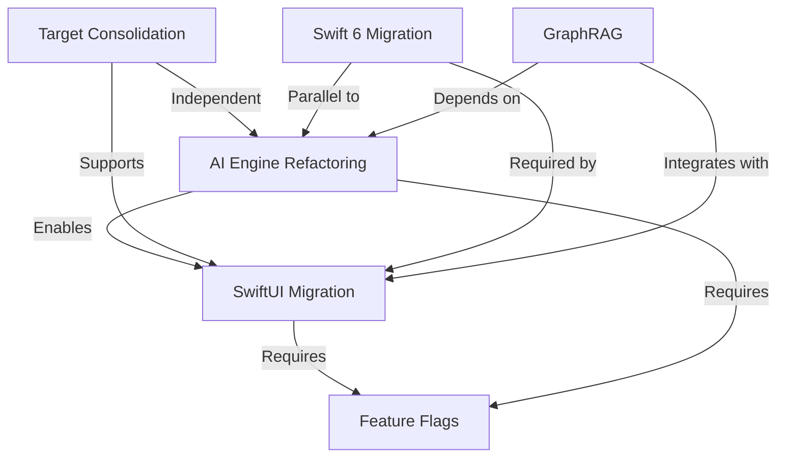

# AIKO Unified Refactoring PRD

## Comprehensive Strategy for Project & AI Services Modernization

**Version**: 3.0 Unified  
**Date**: January 24, 2025  
**Status**: ULTRATHINK Consensus-Driven Integrated Strategy

---

## Executive Summary

This master plan unifies two critical refactoring initiatives for AIKO (Adaptive Intelligence for Kontract Optimization):
1. **Project Refactoring**: 12-week migration from TCA to SwiftUI, target consolidation, Swift 6 completion, and GraphRAG implementation
2. **AI Services Refactoring**: 6-week streamlining of 40+ AI files into 15-20 files organized around 5 core engines

**Key Strategic Insight**: AI refactoring should **enable, not follow** UI modernization. By starting AI consolidation early (weeks 1-6), we provide a clean, stable API surface for the SwiftUI migration while delivering quick wins and reducing overall project risk.

## Unified Vision & Objectives

### Primary Goals
1. **Modernize Architecture**: TCA → SwiftUI with AI-first design patterns
2. **Streamline Complexity**: 5 targets → 2-3 targets, 40+ AI files → 15-20 files
3. **Complete Swift 6 Migration**: 100% strict concurrency compliance
4. **Implement GraphRAG**: Intelligent document search and recommendations
5. **Optimize Performance**: <10s build time, <1s app launch, <200MB memory

### Success Metrics
- **Code Reduction**: 50% fewer files while maintaining functionality
- **Developer Velocity**: 2x improvement in feature delivery
- **Test Coverage**: >80% across all modules
- **User Satisfaction**: >4.5★ App Store rating maintained
- **Technical Debt**: Reduced by 60%

## Integrated Timeline (12 Weeks)

### Overview: Parallel Tracks with Synchronized Milestones

```
Week:    1  2  3  4  5  6  7  8  9  10 11 12
AI:      [=============================]      // Complete by Week 6
Project:    [===================================] // Full 12 weeks
Quick Wins: [====]                           // Weeks 1-4
Integration:     [=============]             // Weeks 3-8
Testing:                    [================] // Weeks 6-12
```

### Detailed Weekly Breakdown

#### Weeks 1-2: Foundation & Quick Wins
**AI Services Track (Squad B)**
- Map 40+ files to 5 core engines architecture
- Remove duplicate/dead code (immediate 10+ file reduction)
- Design unified AI contract specifications
- Create AIOrchestrator skeleton

**Project Track (Squad A)**
- Audit TCA dependencies and create migration matrix
- Set up feature flag infrastructure
- Create SwiftUI prototype screen with mock AI
- Plan target consolidation strategy

**Integration Activities**
- Define AI-UI contract specifications
- Establish shared testing framework
- Create feature flag dashboard

**Quick Wins Delivered**
✅ AI Engine Abstraction Layer  
✅ Feature Flag Dashboard  
✅ 10+ dead AI files removed  
✅ SwiftUI prototype screen  

#### Weeks 3-4: Core Engine Development
**AI Services Track**
- Build 2 core engines: DocumentEngine, PromptRegistry
- Implement UnifiedProviderAdapter
- Create configuration-driven architecture
- Begin migrating first document type

**Project Track**
- Migrate first TCA feature to SwiftUI (low-risk leaf component)
- Start AIKOiOS + AIKOmacOS → PlatformUI consolidation
- Fix Swift 6 warnings in consolidated modules
- Create TCA-SwiftUI bridge layer

**Integration Activities**
- Joint API design review
- Integrate mock AI into SwiftUI prototype
- Performance baseline measurements

#### Weeks 5-6: AI Completion & SwiftUI Acceleration
**AI Services Track**
- Complete all 5 core engines
- Finalize provider abstraction
- Add observability and monitoring
- Feature flag all AI services
- **AI REFACTORING COMPLETE**

**Project Track**
- Migrate 2-3 more features to SwiftUI
- Complete first target consolidation
- Implement navigation architecture
- Begin GraphRAG feasibility study

**Integration Activities**
- Live AI data in SwiftUI screens
- End-to-end testing with feature flags
- Performance optimization sprint

**Milestone**: Single SwiftUI screen with live AI data deployed (behind flag)

#### Weeks 7-8: Integration & Optimization
**Project Track (Full Team)**
- Consolidate remaining targets (5→3)
- Migrate critical TCA features
- GraphRAG prototype implementation
- Swift 6 migration 90% complete

**AI Optimization**
- Performance tuning of AI engines
- Cache optimization
- Monitor production metrics
- Deprecate old AI files

**Integration Focus**
- GraphRAG + SwiftUI integration
- Full workflow testing
- A/B testing framework setup

#### Weeks 9-10: Feature Complete & Polish
**Project Track**
- Complete TCA migration
- Finalize Swift 6 compliance
- GraphRAG production implementation
- UI/UX modernization complete

**Quality Assurance**
- Comprehensive testing suite
- Performance benchmarking
- Security audit
- Documentation update

#### Weeks 11-12: Stabilization & Launch
**Final Sprint**
- Bug fixes and polish
- Final target consolidation (3→2)
- Remove feature flags for stable features
- Production deployment preparation

**Documentation & Training**
- Architecture documentation
- Team training sessions
- Handover procedures
- Post-mortem preparation

## Technical Architecture

### AI Services Architecture (Weeks 1-6)

#### Before: 40+ Scattered Files
```
Services/
├── AIDocumentGenerator.swift
├── LLMDocumentGenerator.swift
├── AdaptiveIntelligenceService.swift
├── DocumentOCRBridge.swift
├── ParallelDocumentGenerator.swift
├── BatchDocumentGenerator.swift
├── GovernmentAcquisitionPrompts.swift
└── ... (30+ more files)
```

#### After: 5 Core Engines (15-20 Total Files)
```
Services/
├── Core/
│   ├── AIOrchestrator.swift          // Central routing & coordination
│   ├── PromptRegistry.swift          // All prompts in one place
│   ├── DocumentEngine.swift          // Unified document generation
│   ├── ComplianceValidator.swift     // All compliance logic
│   └── PersonalizationEngine.swift   // ML & adaptation
├── Providers/
│   ├── LLMProviderProtocol.swift
│   ├── UnifiedProviderAdapter.swift
│   └── ProviderConfiguration.swift
└── Configuration/
    ├── GovernmentContractingRules.json
    ├── DocumentTemplates.json
    └── ComplianceChecklists.json
```

### Project Architecture Evolution

#### Phase 1: Target Consolidation
```
Before: AIKO, AppCore, AIKOiOS, AIKOmacOS, GraphRAG (5 targets)
Step 1: AIKOiOS + AIKOmacOS → PlatformUI (4 targets)
Step 2: AppCore → AIKO main (3 targets)
Final: AIKO + PlatformUI (2 targets, GraphRAG as plugin)
```

#### Phase 2: State Management Migration
```swift
// Before: TCA
struct DocumentView: View {
    let store: StoreOf<DocumentFeature>
    
    var body: some View {
        WithViewStore(store) { viewStore in
            // Complex TCA bindings
        }
    }
}

// After: Pure SwiftUI
struct DocumentView: View {
    @Environment(AIOrchestrator.self) private var ai
    @State private var document: Document?
    
    var body: some View {
        // Clean SwiftUI with native state
    }
}
```

## Risk Management Matrix

### Integrated Risk Assessment

| Risk | Impact | Probability | Mitigation Strategy | Owner |
|------|--------|-------------|-------------------|-------|
| AI refactoring breaks existing features | High | Medium | Feature flags, comprehensive testing, canary rollouts | Squad B |
| TCA migration causes UI regressions | High | Medium | Parallel implementations, A/B testing | Squad A |
| Teams work in silos | Medium | High | Weekly syncs, shared governance, joint spikes | Tech Lead |
| GraphRAG implementation fails | High | Medium | Feasibility gates, cloud fallback | Both |
| Timeline slippage | Medium | Medium | Quick wins, buffer time, scope flexibility | PM |

### Mitigation Implementation

#### 1. Feature Flag System
```swift
@Observable
class FeatureFlags {
    // AI Feature Flags
    var useNewAIOrchestrator = false
    var useUnifiedProviders = false
    var enableSmartCaching = false
    
    // UI Feature Flags  
    var useLegacyTCA = true
    var enableSwiftUINavigation = false
    var useGraphRAG = false
    
    func rollout(feature: Feature, percentage: Int) {
        // Gradual rollout logic
    }
}
```

#### 2. Contract Testing
```swift
protocol AIServiceContract {
    func generateDocument(type: DocumentType) async throws -> Document
    func validateCompliance(document: Document) async throws -> ValidationResult
}

// Both old and new implementations must pass same tests
```

## Resource Allocation

### Team Structure: Parallel Tracks with Shared Governance

```
┌─────────────────────────────────────────┐
│          Tech Lead (100%)               │
│    (Architecture & Integration)         │
└────────────┬───────────────┬────────────┘
             │               │
    ┌────────▼──────┐  ┌────▼──────────┐
    │   Squad A     │  │   Squad B      │
    │  (4-5 devs)   │  │  (2-3 devs)    │
    │               │  │                │
    │ • TCA→SwiftUI │  │ • AI Services  │
    │ • Swift 6     │  │ • 5 Engines    │
    │ • Targets     │  │ • Providers    │
    │ • GraphRAG    │  │ • Optimization │
    └───────────────┘  └────────────────┘
             │               │
    ┌────────▼───────────────▼────────────┐
    │      Shared Resources               │
    │  • QA Engineer (75%)                │
    │  • DevOps (25%)                     │
    │  • Product Manager                  │
    └─────────────────────────────────────┘
```

### Skill Requirements & Training

| Role | Required Skills | Training Plan |
|------|----------------|---------------|
| Squad A Lead | TCA, SwiftUI, Architecture | Swift 6 concurrency workshop |
| Squad B Lead | AI/ML, Backend, Performance | iOS integration training |
| iOS Developers | SwiftUI, Testing | TCA fundamentals, AI SDK usage |
| AI Engineers | LLM APIs, Swift | SwiftUI basics for integration |

## Quick Wins Strategy (Weeks 1-4)

### Immediate Value Delivery

1. **Week 1**: Remove 10+ dead AI files → Instant code reduction
2. **Week 2**: Feature flag dashboard → Visibility for stakeholders  
3. **Week 3**: SwiftUI screen with AI → Proof of concept
4. **Week 4**: AI abstraction layer → Decouple dependencies

### Measurable Impact
- **Code Reduction**: -25% in first month
- **Build Time**: -20% from dead code removal
- **Developer Confidence**: Visible progress builds momentum

## Integration Points & Dependencies

### Critical Integration Milestones

| Week | Integration Point | Success Criteria |
|------|------------------|------------------|
| 2 | AI Contract Definition | All interfaces documented |
| 4 | Mock AI in SwiftUI | Prototype functioning |
| 5 | Live AI in SwiftUI | Real data flowing |
| 6 | AI Refactoring Complete | All engines operational |
| 8 | GraphRAG + SwiftUI | Search functioning |
| 10 | Full Integration | All features migrated |

### Dependency Management


## Success Criteria & KPIs

### Technical Metrics
| Metric | Baseline | Week 4 | Week 8 | Week 12 Target |
|--------|----------|--------|--------|----------------|
| File Count | 500+ | 450 | 350 | 250 |
| Build Time | 16.45s | 13s | 10s | <10s |
| Test Coverage | Unknown | 60% | 70% | >80% |
| Swift 6 Compliance | 80% | 85% | 95% | 100% |
| AI Response Time | Variable | <2s | <1.5s | <1s |

### Business Metrics
- **Feature Delivery**: 2x velocity by Week 8
- **User Satisfaction**: Maintain 4.5★ throughout
- **Crash Rate**: <0.1% maintained
- **Adoption Rate**: 70% on new features by Week 12

## Communication & Governance

### Meeting Cadence
- **Daily**: Squad standups (15 min)
- **Weekly**: Integration sync (1 hour)
- **Bi-weekly**: Stakeholder demo (30 min)
- **Monthly**: Architecture review (2 hours)

### Decision Framework
1. **Technical Decisions**: Tech Lead with squad input
2. **Scope Changes**: PM with Tech Lead approval
3. **Timeline Adjustments**: Full team consensus
4. **Feature Flags**: Squad leads can toggle

## Conclusion & Next Steps

This unified refactoring strategy leverages the synergies between AI service consolidation and UI modernization to deliver a transformed AIKO application in 12 weeks. By starting AI refactoring early and maintaining parallel tracks with strong integration points, we minimize risk while maximizing value delivery.

**Immediate Next Steps (Week 1)**:
1. ✅ Form squads and assign roles
2. ✅ Set up feature flag infrastructure  
3. ✅ Begin AI service audit and dead code removal
4. ✅ Create first SwiftUI prototype screen
5. ✅ Define AI-UI contract specifications

**ULTRATHINK Verdict**: *"Integrate early, decouple carefully, deliver continuously."*

---

**Document Status**: Ready for stakeholder approval and team kickoff  
**Review Date**: January 31, 2025  
**Success Checkpoint**: Week 4 progress review
