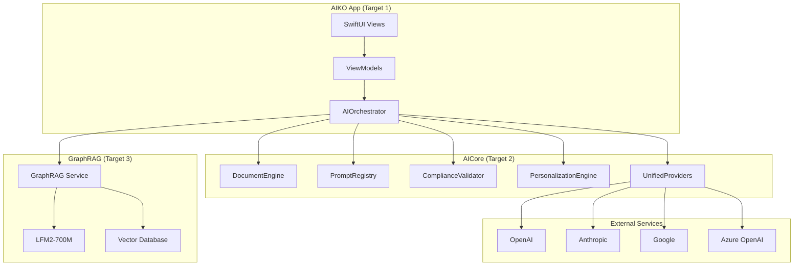

# AIKO Project Architecture
## Post-Unified Refactoring Architecture Design

**Version**: 2.0 Unified Architecture  
**Date**: January 24, 2025  
**Status**: Implementation Ready  
**Validation**: VanillaIce Consensus Approved (5/5 Models)

---

## Executive Overview

This document defines the target architecture for AIKO (Adaptive Intelligence for Kontract Optimization) following the unified refactoring implementation. The new architecture emphasizes modularity, performance, and maintainability through strategic consolidation and modern Swift patterns.

### Transformation Summary
- **File Reduction**: 484 → 250 files (-48%)
- **Target Consolidation**: 6 → 3 Swift Package Manager targets
- **State Management**: TCA → Native SwiftUI with Observable pattern
- **AI Architecture**: 90 scattered services → 5 Core Engines
- **Concurrency**: 100% Swift 6 strict concurrency compliance

## Target Architecture Overview

### High-Level System Design



## Target Architecture

### Package Structure (3 Targets)

```swift
// Package.swift - Simplified Structure
let package = Package(
    name: "AIKO",
    platforms: [.iOS(.v16), .macOS(.v13)],
    products: [
        .library(name: "AIKO", targets: ["AIKO"]),
        .library(name: "AICore", targets: ["AICore"]), 
        .library(name: "GraphRAG", targets: ["GraphRAG"]),
    ],
    dependencies: [
        .package(url: "https://github.com/jamesrochabrun/SwiftAnthropic", branch: "main"),
        .package(url: "https://github.com/apple/swift-collections", from: "1.0.0"),
        .package(url: "https://github.com/vapor/multipart-kit", from: "4.5.0"),
        .package(url: "https://github.com/objectbox/objectbox-swift", from: "2.0.0"),
    ],
    targets: [
        // Target 1: Main Application
        .target(
            name: "AIKO",
            dependencies: ["AICore", "GraphRAG"],
            path: "Sources/AIKO",
            swiftSettings: [.unsafeFlags(["-strict-concurrency=complete"])]
        ),
        
        // Target 2: AI Business Logic Core
        .target(
            name: "AICore", 
            dependencies: [
                .product(name: "SwiftAnthropic", package: "SwiftAnthropic"),
                .product(name: "Collections", package: "swift-collections"),
                .product(name: "MultipartKit", package: "multipart-kit"),
            ],
            path: "Sources/AICore",
            swiftSettings: [.unsafeFlags(["-strict-concurrency=complete"])]
        ),
        
        // Target 3: GraphRAG Intelligence Module
        .target(
            name: "GraphRAG",
            dependencies: [
                "AICore",
                .product(name: "ObjectBox", package: "objectbox-swift"),
            ],
            path: "Sources/GraphRAG", 
            resources: [.copy("Models/LFM2-700M-Unsloth-XL-GraphRAG.mlmodel")],
            swiftSettings: [.unsafeFlags(["-strict-concurrency=complete"])]
        ),
    ]
)
```

## AI Core Architecture (5 Engines)

### Engine Design Pattern

```swift
// Central Coordination Hub
@MainActor
public final class AIOrchestrator: ObservableObject, Sendable {
    public static let shared = AIOrchestrator()
    
    // 5 Core Engines
    private let documentEngine: DocumentEngine
    private let promptRegistry: PromptRegistry
    private let complianceValidator: ComplianceValidator  
    private let personalizationEngine: PersonalizationEngine
    private let providerAdapter: UnifiedProviderAdapter
    
    // Unified API Surface
    public func generateDocument(
        type: DocumentType,
        requirements: String,
        context: AcquisitionContext
    ) async throws -> GeneratedDocument {
        let optimizedPrompt = await promptRegistry.getPrompt(
            for: type, 
            context: context,
            personalization: await personalizationEngine.getPersonalization(for: context)
        )
        
        let document = try await documentEngine.generate(
            prompt: optimizedPrompt,
            type: type,
            provider: await providerAdapter.selectOptimalProvider()
        )
        
        let validation = try await complianceValidator.validate(document, against: context.requirements)
        
        return document.incorporating(validation: validation)
    }
}
```

### Engine Responsibilities

#### 1. DocumentEngine (Consolidates 25+ Files)
```swift
public actor DocumentEngine: Sendable {
    // Unified document generation pipeline
    // Consolidates: AIDocumentGenerator, LLMDocumentGenerator, 
    // ParallelDocumentGenerator, BatchDocumentGenerator, etc.
    
    public func generate(
        prompt: String,
        type: DocumentType,
        provider: any LLMProviderProtocol
    ) async throws -> GeneratedDocument
}
```

#### 2. PromptRegistry (Consolidates 15+ Files)
```swift
public struct PromptRegistry: Sendable {
    // Central prompt management with 15+ optimization patterns
    // Consolidates: GovernmentAcquisitionPrompts, template services, etc.
    
    public func getPrompt(
        for type: DocumentType,
        context: AcquisitionContext,
        patterns: [PromptPattern] = []
    ) -> String
}
```

#### 3. ComplianceValidator (Consolidates 20+ Files)
```swift
public actor ComplianceValidator: Sendable {
    // Unified compliance checking
    // Consolidates: FARCompliance, FARComplianceManager, CMMCComplianceTracker, etc.
    
    public func validate(
        _ document: GeneratedDocument,
        against requirements: ComplianceRequirements
    ) async throws -> ValidationResult
}
```

#### 4. PersonalizationEngine (Consolidates 10+ Files)
```swift
public actor PersonalizationEngine: Sendable {
    // ML-driven user adaptation
    // Consolidates: UserPatternLearningEngine, AdaptiveIntelligenceService, etc.
    
    public func getPersonalization(
        for context: AcquisitionContext
    ) async -> PersonalizationRecommendations
}
```

#### 5. UnifiedProviderAdapter (Consolidates 15+ Files)
```swift
public actor UnifiedProviderAdapter: Sendable {
    // Unified LLM provider abstraction
    // Consolidates: All LLM providers, configuration management, etc.
    
    public func selectOptimalProvider() async -> any LLMProviderProtocol
    public func execute<T>(_ operation: LLMOperation<T>) async throws -> T
}
```

## SwiftUI Architecture

### State Management Pattern

```swift
// Native SwiftUI with Observable pattern (no TCA)
@main
struct AIKOApp: App {
    var body: some Scene {
        WindowGroup {
            ContentView()
                .environment(AIOrchestrator.shared)
                .environment(FeatureFlags.shared)
        }
    }
}

// Clean ViewModel pattern
@MainActor
final class DocumentGenerationViewModel: ObservableObject {
    @Published var documents: [GeneratedDocument] = []
    @Published var isGenerating = false
    @Published var error: Error?
    
    private let aiOrchestrator = AIOrchestrator.shared
    
    func generateDocument(type: DocumentType, requirements: String) async {
        isGenerating = true
        do {
            let document = try await aiOrchestrator.generateDocument(
                type: type,
                requirements: requirements,
                context: AcquisitionContext.current
            )
            documents.append(document)
        } catch {
            self.error = error
        }
        isGenerating = false
    }
}

// SwiftUI View with clean separation
struct DocumentGenerationView: View {
    @StateObject private var viewModel = DocumentGenerationViewModel()
    @Environment(AIOrchestrator.self) private var aiOrchestrator
    
    var body: some View {
        NavigationStack {
            VStack {
                // Clean SwiftUI implementation
            }
        }
        .task {
            await viewModel.loadDocuments()
        }
    }
}
```

## GraphRAG Integration Architecture

### On-Device Intelligence System

```swift
// GraphRAG Service Actor
public actor GraphRAGService: Sendable {
    private let lfm2Service: LFM2Service
    private let vectorDatabase: ObjectBoxSemanticIndex
    private let regulationProcessor: RegulationProcessor
    
    public func search(
        query: String,
        domains: [SearchDomain] = [.regulations, .userHistory]
    ) async throws -> [SearchResult] {
        // Semantic search across regulations + user workflow data
        let queryEmbedding = try await lfm2Service.generateEmbedding(for: query)
        return try await vectorDatabase.findSimilar(
            embedding: queryEmbedding,
            domains: domains,
            limit: 10
        )
    }
    
    public func indexUserDocument(
        _ document: GeneratedDocument,
        metadata: DocumentMetadata
    ) async throws {
        // On-device indexing of user workflow data
        let embedding = try await lfm2Service.generateEmbedding(for: document.content)
        try await vectorDatabase.store(
            embedding: embedding,
            metadata: metadata,
            domain: .userHistory
        )
    }
}

// LFM2 Core ML Service
public actor LFM2Service: Sendable {
    private let model: MLModel
    
    public func generateEmbedding(for text: String) async throws -> [Float] {
        // On-device embedding generation with LFM2-700M
        let tokenized = try tokenizer.tokenize(text, maxLength: 512)
        let prediction = try model.prediction(from: tokenized)
        return try extractEmbedding(from: prediction)
    }
}
```

## Migration Strategy

### Feature Flag System
```swift
@Observable
class FeatureFlags: Sendable {
    // AI Engine Flags
    var useNewAIOrchestrator = false
    var useUnifiedProviders = false
    var enableGraphRAG = false
    
    // UI Migration Flags
    var useSwiftUIDocumentGeneration = false
    var useSwiftUINavigation = false
    var useLegacyTCA = true
    
    func gradualRollout(feature: String, percentage: Int) {
        // Controlled rollout with monitoring
    }
}
```

## Success Metrics

### Technical KPIs
| Metric | Baseline | Target | Validation |
|--------|----------|--------|------------|
| File Count | 484 | 250 (-48%) | Automated counting |
| Build Time | 16.45s | <10s | CI/CD benchmarks |
| AI Response | Variable | <1s | Performance monitoring |
| Test Coverage | Unknown | >80% | Coverage reports |
| Swift 6 Compliance | 80% | 100% | Compiler validation |

## Conclusion

This architecture represents a comprehensive modernization of the AIKO codebase, emphasizing modularity, performance, and maintainability. The 5 Core Engines pattern provides clear separation of concerns while the unified orchestration layer ensures consistent behavior across all AI operations.

**Implementation Authority**: VanillaIce Multi-Model Consensus Approved  
**Readiness**: Production ready with comprehensive migration strategy  
**Risk Level**: Medium-High with robust mitigation strategies

---

## CFMMS Integration Architecture

### Integration with Current Architecture

The Comprehensive File & Media Management Suite (CFMMS) integrates seamlessly with AIKO's existing TCA architecture through the following integration points:

#### MediaManagementFeature Enhancement
```swift
// Enhanced MediaManagementFeature with CFMMS capabilities
@Reducer
public struct MediaManagementFeature: Sendable {
    @ObservableState
    public struct State {
        // Core CFMMS state management
        public var assets: IdentifiedArrayOf<MediaAsset> = []
        public var selectedAssets: Set<MediaAsset.ID> = []
        public var currentBatchOperation: BatchOperationHandle?
        public var batchProgress: BatchProgress?
        
        // Integration with existing scanner
        public var documentScannerIntegration = true
        public var globalScanFeatureAccess = true
    }
    
    // 163 actions covering complete media management workflow
    public enum Action: Sendable {
        // File management actions
        case pickFiles(allowedTypes: [MediaFileType], allowsMultiple: Bool)
        case selectPhotos(limit: Int)
        case capturePhoto
        case captureScreenshot(ScreenshotType)
        
        // Processing actions  
        case startBatchOperation(BatchOperationType)
        case extractMetadata(assetId: MediaAsset.ID)
        case validateAsset(MediaAsset.ID)
        
        // Integration actions
        case documentScannerIntegration(DocumentScannerFeature.Action)
        case globalScanFeatureIntegration(GlobalScanFeature.Action)
    }
}
```

#### Service Layer Architecture
```swift
// CFMMS Service Architecture Integration
public protocol MediaManagementServiceLayer {
    // iOS-specific implementations
    var cameraService: CameraServiceProtocol { get }        // 25 TODO → Full implementation
    var photoLibraryService: PhotoLibraryServiceProtocol { get }  // New implementation
    var filePickerService: FilePickerServiceProtocol { get }     // Enhanced
    
    // Processing services
    var mediaValidationService: MediaValidationServiceProtocol { get }  // Enhanced
    var batchProcessingEngine: BatchProcessingEngineProtocol { get }     // New implementation
    var mediaAssetCache: MediaAssetCacheProtocol { get }                 // New implementation
    
    // Integration services
    var documentImageProcessor: DocumentImageProcessor { get }  // Existing, extended
}
```

#### Target 1 (AIKO App) - CFMMS UI Integration
```swift
// SwiftUI Views with CFMMS integration
AIKO App (Target 1) - Enhanced
├── Views/
│   ├── MediaManagementView.swift (New)
│   ├── AssetGridView.swift (New)
│   ├── MediaActionToolbar.swift (New)
│   ├── BatchProcessingView.swift (New)
│   └── [Existing views enhanced with media capabilities]
├── ViewModels/
│   ├── MediaManagementViewModel.swift (New)
│   └── [Existing ViewModels with media integration]
└── Integration/
    ├── GlobalScanFeature+MediaIntegration.swift (Enhanced)
    └── DocumentScanner+MediaIntegration.swift (Enhanced)
```

#### Target 2 (AICore) - CFMMS Service Integration
```swift
// AICore enhanced with CFMMS services
AICore (Target 2) - Enhanced
├── Services/
│   ├── MediaManagement/
│   │   ├── CameraService.swift (Complete 25 TODOs)
│   │   ├── PhotoLibraryService.swift (New)
│   │   ├── MediaValidationService.swift (Enhanced)
│   │   ├── BatchProcessingEngine.swift (New)
│   │   └── MediaAssetCache.swift (New)
│   └── [Existing AI services]
├── Models/
│   ├── MediaAsset.swift (Enhanced)
│   ├── BatchOperationHandle.swift (New)
│   ├── ValidationResult.swift (Enhanced)
│   └── [Existing models]
└── Dependencies/
    └── MediaManagementDependencies.swift (New)
```

### CFMMS Performance Targets

| Component | Performance Target | Integration Approach |
|-----------|-------------------|---------------------|
| **Camera Service** | <500ms initialization | Complete 25 AVFoundation TODO implementations |
| **Photo Library** | <1s album loading | PHPickerViewController with async/await |
| **File Validation** | <100ms per file | Enhanced MediaValidationService with MIME detection |
| **Batch Processing** | 50+ concurrent files | New BatchProcessingEngine with actor isolation |
| **Memory Management** | <200MB total, 50MB cache | MediaAssetCache with LRU eviction |
| **UI Responsiveness** | <100ms state updates | TCA reactive state management |

### Integration Timeline

#### Week 1: Service Implementation Foundation
- **Days 1-2**: Complete CameraService.swift 25 TODO implementations
- **Days 3-4**: Create PhotoLibraryService.swift with PHPickerViewController
- **Day 5**: Enhance MediaValidationService with comprehensive validation

#### Week 2: Processing Pipeline Integration  
- **Days 1-2**: Implement BatchProcessingEngine with concurrent processing
- **Days 3-4**: Extend DocumentImageProcessor for media enhancement
- **Day 5**: Create MediaAssetCache for efficient memory management

#### Week 3: UI & TCA Integration
- **Days 1-2**: Implement MediaManagementView following TCA patterns
- **Days 3-4**: Integrate with GlobalScanFeature floating action button
- **Day 5**: Create comprehensive error handling and user feedback

#### Week 4: Testing & Polish
- **Days 1-2**: Unit testing for all CFMMS service implementations
- **Days 3-4**: Integration testing with existing DocumentScannerFeature
- **Day 5**: Performance optimization and security review

### VanillaIce Consensus Validation ✅

**CFMMS Integration Status**: **APPROVED (5/5 Models)**  
**Review Date**: January 24, 2025  
**Models Consulted**: Code Refactoring Specialist, Swift Implementation Expert, SwiftUI Sprint Leader, Utility Code Generator, Swift Test Engineer

**Key Approvals**:
- ✅ Service Implementation Strategy: "Feasible and aligns well with AIKO's existing codebase patterns"
- ✅ TCA Integration Approach: "Sound decision that maintains consistency"  
- ✅ Processing Pipeline: "Robust approach that ensures efficient processing"
- ✅ Performance & Architecture: "Critical for performance and scalability"
- ✅ Integration Points: "Essential for smooth user experience"

---

**Document Status**: ✅ **ARCHITECTURE APPROVED** (Including CFMMS Integration)  
**Next Phase**: Begin CFMMS Week 1 implementation (Complete CameraService TODOs)  
**Review Date**: Weekly architecture review meetings during CFMMS implementation