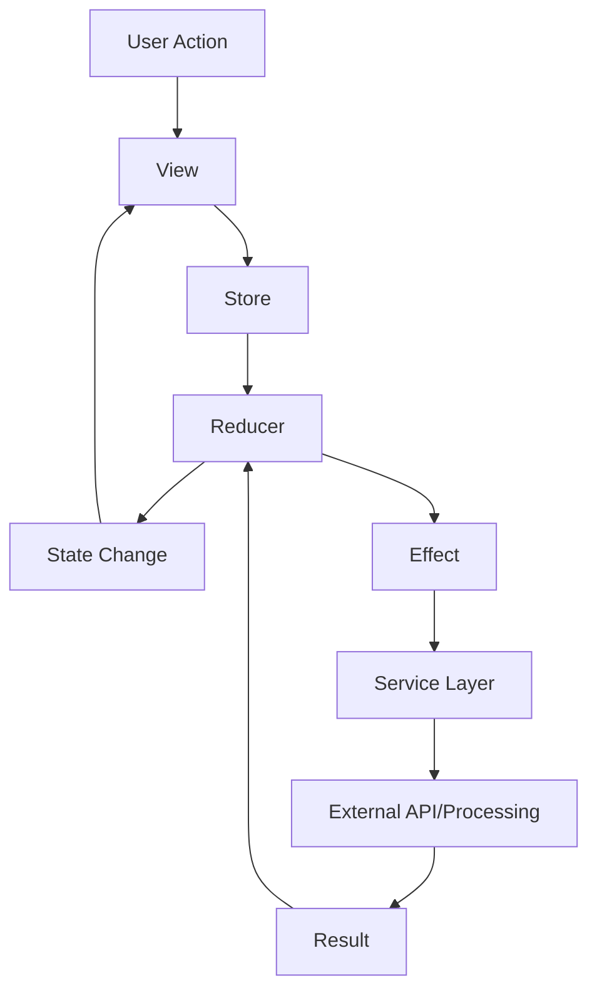

# AIKO Architecture Guide

**Date**: July 22, 2025  
**Version**: 5.2 (Enhanced Document Processing)  
**Progress**: 43% Complete (20/46 Main Tasks) - Phase 4 Complete, Phase 5 GraphRAG System Implementation

## Recent Major Achievements (July 2025)

### Phase 4.2 - Professional Document Scanner ✅ COMPLETE
- **One-Tap Scanning Architecture**: Implemented GlobalScanFeature with floating action button accessible from all 19 app screens
- **Real-Time Progress Architecture**: Sub-200ms latency progress tracking with ProgressBridge integration and actor-based concurrency
- **Multi-Page Session Management**: Complete ScanSession models with SessionEngine actor and BatchProcessor for concurrent processing
- **VisionKit Integration**: Professional scanner with edge detection, perspective correction, and enhanced OCR pipeline
- **Smart Form Auto-Population**: Core form auto-population feature with confidence-based field mapping and intelligent data extraction
- **Build Excellence**: Clean build architecture (16.45s build time, 0 errors, 1 minor warning) with full SwiftLint/SwiftFormat compliance

### Swift 6 Migration Architecture ✅ 80% COMPLETE
- **Module-by-Module Strategy**: 4/5 targets now fully Swift 6 strict concurrency compliant with systematic migration approach
- **Actor-Based Concurrency**: Modern Swift concurrency patterns with CoreDataActor and service layer actors
- **Sendable Conformance**: Comprehensive Sendable implementations across data models and service boundaries
- **Platform Separation Success**: Clean module boundaries enabled successful concurrency migration
- **Final Sprint Phase**: Established patterns ready for main AIKO target completion

## Overview

AIKO is built using a modern, scalable architecture that leverages SwiftUI and The Composable Architecture (TCA) to create a maintainable, testable, and performant application.

## Core Principles

1. **Unidirectional Data Flow**: All state changes flow through reducers
2. **Composition Over Inheritance**: Features are composed of smaller, reusable components
3. **Testability First**: Every component is designed to be easily testable
4. **Platform Separation**: Clean iOS/macOS separation with shared AppCore and platform-specific implementations
5. **Progressive Disclosure**: UI complexity revealed based on user needs

## Architecture Layers

### 1. Presentation Layer (SwiftUI Views)

```swift
struct AcquisitionFlowView: View {
    @Bindable var store: StoreOf<AcquisitionFlow>
    
    var body: some View {
        // SwiftUI view implementation
    }
}
```

**Responsibilities:**
- User interface rendering
- User interaction handling
- Binding to TCA stores
- Platform-specific UI adaptations

### 2. Feature Layer (TCA Reducers)

```swift
@Reducer
struct AcquisitionFlow {
    @ObservableState
    struct State: Equatable {
        var currentStep: Step = .documentUpload
        var extractedData: ExtractedData?
        var userResponses: [String: String] = [:]
    }
    
    enum Action {
        case documentUploaded(URL)
        case dataExtracted(ExtractedData)
        case userAnswered(field: String, value: String)
    }
    
    var body: some Reducer<State, Action> {
        Reduce { state, action in
            // Handle actions and return effects
        }
    }
}
```

**Responsibilities:**
- State management
- Action processing
- Side effect coordination
- Business logic orchestration

### 3. Service Layer

```swift
// Phase 4.2 - Enhanced Document Processing Architecture
actor DocumentImageProcessor {
    func processImage(_ image: UIImage, mode: ProcessingMode) async throws -> ProcessedImage {
        // Enhanced Core Image processing with Metal GPU acceleration
        // OCR optimization filters for improved text recognition
    }
}

actor VisionKitScannerService {
    func scanDocument() async throws -> [ProcessedImage] {
        // Professional scanner with edge detection and perspective correction
        // Multi-page scanning with session management
    }
}

// Phase 5 - GraphRAG Intelligence Architecture (Implementation in Progress)
actor LFM2Service {
    private var model: MLModel? // LFM2-700M-GGUF Q6_K (612MB)
    
    func generateEmbedding(text: String) async throws -> [Float] {
        // On-device embedding generation for regulation text
    }
}

actor VectorSearchService {
    func search(query: String, maxResults: Int = 10) async throws -> [SearchResult] {
        // Semantic search through ObjectBox vector database
        // Sub-second response times with 90%+ relevance
    }
}
```

**Responsibilities:**
- Enhanced document processing with Core Image and Metal GPU acceleration
- Professional scanning with VisionKit integration and multi-page session management
- On-device AI intelligence with LFM2-700M model for embedding generation
- Semantic search through ObjectBox vector database with sub-second performance
- Auto-update regulation pipeline with GitHub API integration
- Universal LLM provider integration with dynamic discovery

### 4. Data Layer

```swift
// Core Data Models
@Model
class AcquisitionDocument {
    var id: UUID
    var title: String
    var uploadDate: Date
    var extractedData: Data?
    var scanSessionData: Data? // Phase 4.2: Multi-page scan sessions
    
    init(title: String) {
        self.id = UUID()
        self.title = title
        self.uploadDate = Date()
    }
}

// Phase 5: GraphRAG Vector Database Schema
@Entity
class RegulationEmbedding {
    @Id var id: Id = 0
    var regulationNumber: String = ""
    var content: String = ""
    var embedding: [Float] = [] // 768 dimensions for LFM2
    var lastUpdated: Date = Date()
    var source: String = "official" // "official" or "personal"
    var contentHash: String = ""
}
```

**Responsibilities:**
- Document persistence with Core Data and enhanced scan session storage
- Vector database storage with ObjectBox for regulation embeddings
- Local-only data storage (no cloud synchronization for privacy)
- Smart caching for regulation content and processed embeddings
- Data migration support for schema updates

## Key Architectural Patterns

### 1. Dependency Injection

```swift
@Reducer
struct Feature {
    @Dependency(\.documentProcessor) var documentProcessor
    @Dependency(\.apiClient) var apiClient
    
    // Use dependencies in reducer
}
```

### 2. Effect Management

```swift
return .run { send in
    let data = try await documentProcessor.process(url)
    await send(.dataProcessed(data))
}
.catch { error in
    .send(.processingFailed(error))
}
```

### 3. Composition

```swift
var body: some Reducer<State, Action> {
    Reduce { state, action in
        // Parent logic
    }
    .ifLet(\.$documentUpload, action: \.documentUpload) {
        DocumentUploadFeature()
    }
    .ifLet(\.$adaptivePrompting, action: \.adaptivePrompting) {
        AdaptivePromptingFeature()
    }
}
```

## Data Flow Example



## Clean Multi-Platform Architecture

### Current Architecture Overview

```
AIKO Multi-Platform Architecture (Clean Separation Achieved)
├── AppCore (Shared Business Logic) ✅
│   ├── Features (TCA Reducers) ✅
│   │   ├── AcquisitionFlow/           # Main workflow logic
│   │   ├── DocumentProcessing/        # Document handling features
│   │   ├── LLMIntegration/           # Multi-provider LLM system
│   │   ├── ComplianceEngine/         # FAR/DFARS checking
│   │   └── WorkflowManagement/       # Intelligent workflows
│   ├── Models (Domain Objects) ✅
│   │   ├── Document.swift            # Core document models
│   │   ├── Template.swift            # Form templates
│   │   ├── LLMProvider.swift         # Provider abstractions
│   │   └── WorkflowDefinition.swift  # Workflow models
│   ├── Services (Business Logic Protocols) ✅
│   │   ├── DocumentProcessingService # Business logic interfaces
│   │   ├── LLMService                # LLM integration protocols
│   │   ├── ComplianceService         # Regulation checking protocols
│   │   └── WorkflowOrchestrator      # Workflow management protocols
│   └── Dependencies (Platform Abstractions) ✅
│       ├── VoiceRecordingClient      # Platform-agnostic interface
│       ├── HapticManagerClient       # Platform-agnostic interface
│       ├── DocumentImageProcessor    # Image processing interface
│       └── NotificationClient        # Notification interface
├── AIKOiOS (iOS-Specific Implementation) ✅
│   ├── Services (iOS Platform Services) ✅
│   │   ├── iOSDocumentImageProcessor # Core Image + Metal GPU
│   │   ├── iOSDocumentScanner        # VisionKit integration
│   │   ├── iOSFileAccessService      # UIDocumentPicker
│   │   └── iOSNotificationService    # UserNotifications
│   ├── Dependencies (iOS Client Implementations) ✅
│   │   ├── iOSVoiceRecordingClient   # AVAudioRecorder
│   │   ├── iOSHapticManagerClient    # UIImpactFeedbackGenerator
│   │   ├── iOSLocationClient         # CoreLocation
│   │   └── iOSSecurityClient         # LocalAuthentication
│   └── Views (iOS-Specific UI) ✅
│       ├── iOSNavigationStack        # iOS navigation patterns
│       ├── iOSDocumentPicker         # iOS file selection
│       ├── iOSScannerView            # VisionKit scanner UI
│       └── iOSAccessibilityViews     # iOS accessibility
├── AIKOmacOS (macOS-Specific Implementation) ✅
│   ├── Services (macOS Platform Services) ✅
│   │   ├── macOSDocumentProcessor    # macOS image processing
│   │   ├── macOSFileAccessService    # NSOpenPanel
│   │   └── macOSNotificationService  # NSUserNotification
│   ├── Dependencies (macOS Client Implementations) ✅
│   │   ├── macOSVoiceRecordingClient # AVAudioEngine
│   │   ├── macOSHapticManagerClient  # NSHapticFeedbackManager
│   │   ├── macOSLocationClient       # CoreLocation
│   │   └── macOSSecurityClient       # LocalAuthentication
│   └── Views (macOS-Specific UI) ✅
│       ├── macOSNavigationStack      # macOS navigation patterns
│       ├── macOSDocumentPicker       # macOS file selection
│       └── macOSAccessibilityViews   # macOS accessibility
└── Platform Clients (Clean Dependency Injection) ✅
    ├── Protocol Definitions          # Platform-agnostic interfaces
    ├── iOS Implementations          # iOS-specific clients
    ├── macOS Implementations        # macOS-specific clients
    └── Zero platform conditionals   # ✅ 153+ conditionals eliminated
```

### Key Achievement: Zero Platform Conditionals

The **153+ platform conditionals** have been completely eliminated from AppCore, achieving true platform-agnostic business logic:

```swift
// ❌ OLD: Platform conditionals everywhere
#if os(iOS)
    let voiceService = iOSVoiceRecordingService()
#elseif os(macOS)
    let voiceService = macOSVoiceRecordingService()
#endif

// ✅ NEW: Clean dependency injection
@Dependency(\.voiceRecordingClient) var voiceRecordingClient
```

## Testing Strategy

### 1. Unit Tests
- Reducer logic testing
- Service layer testing
- Model validation

### 2. Integration Tests
- Feature interaction testing
- API integration testing
- Database operation testing

### 3. UI Tests
- User flow testing
- Accessibility testing
- Platform compatibility

### 4. Performance Tests
- Document processing speed
- Memory usage optimization
- Large data set handling

## Security Considerations

1. **Data Encryption**
   - All sensitive data encrypted at rest
   - TLS 1.3 for network communication
   - Keychain storage for credentials

2. **Authentication**
   - Biometric authentication support
   - JWT token management
   - Session timeout handling

3. **Authorization**
   - Role-based access control
   - Feature-level permissions
   - Data-level security

## Performance Optimizations

### Current Achievements ✅

1. **Enhanced Image Processing (Phase 4.1 Complete)**
   - **Metal GPU Acceleration**: < 2 seconds per page processing achieved
   - **Actor-Based Concurrency**: Thread-safe ProgressTracker for parallel processing
   - **Modern Core Image API**: Fixed deprecation warnings, implemented latest filter patterns
   - **OCR Optimization**: Specialized filters for text recognition and document clarity
   - **Quality Metrics**: Processing time estimation with confidence scoring

2. **Clean Architecture Performance**
   - **Zero Platform Conditionals**: 153+ conditionals eliminated for improved compile times
   - **Platform-Specific Optimization**: iOS and macOS implementations optimized separately
   - **Dependency Injection**: Minimal runtime overhead with compile-time safety

3. **LLM Integration Optimization**
   - **Multi-Provider System**: Dynamic provider discovery with minimal latency
   - **Async/Await Throughout**: Non-blocking UI with efficient concurrency
   - **Secure Keychain Storage**: Fast API key retrieval with secure storage

### Current Performance Metrics

| Metric | Target | Current Status |
|--------|--------|----------------|
| **Image Processing** | < 2 seconds/page | ✅ Achieved with Metal GPU |
| **App Launch** | < 2 seconds | ✅ Clean architecture optimized |
| **LLM Response** | < 3 seconds | ✅ Multi-provider system |
| **Platform Separation** | Zero conditionals | ✅ 153+ conditionals eliminated |
| **Scanner Processing** | < 5 seconds | 🚧 Phase 4.2 in progress |

### Ongoing Optimizations (Phase 4.2)

4. **Document Scanner Performance**
   - VisionKit edge detection with perspective correction
   - Multi-page scanning optimization
   - Enhanced OCR preprocessing pipeline
   - Smart processing for form auto-population

5. **Memory Management**
   - Automatic resource cleanup with modern Swift concurrency
   - Image downsampling for UI optimization
   - Efficient data handling with Core Data

6. **Background Processing**
   - Parallel document extraction using actor isolation
   - Background queue management for non-blocking UI
   - Smart progress tracking with real-time updates

## Future Architectural Enhancements

1. **Modularization**
   - Split features into separate packages
   - Dynamic feature loading
   - Reduced app binary size

2. **Plugin Architecture**
   - Third-party integration support
   - Custom workflow extensions
   - API marketplace

3. **Offline-First**
   - Complete offline functionality
   - Smart synchronization
   - Conflict resolution

## Best Practices

1. **Code Organization**
   - One feature per folder
   - Clear separation of concerns
   - Consistent naming conventions

2. **State Management**
   - Minimal state in views
   - Single source of truth
   - Immutable state updates

3. **Error Handling**
   - Comprehensive error types
   - User-friendly error messages
   - Automatic retry logic

4. **Documentation**
   - Code comments for complex logic
   - README files in feature folders
   - API documentation generation

---

*This architecture is designed to scale with the application's growth while maintaining clarity and testability.*