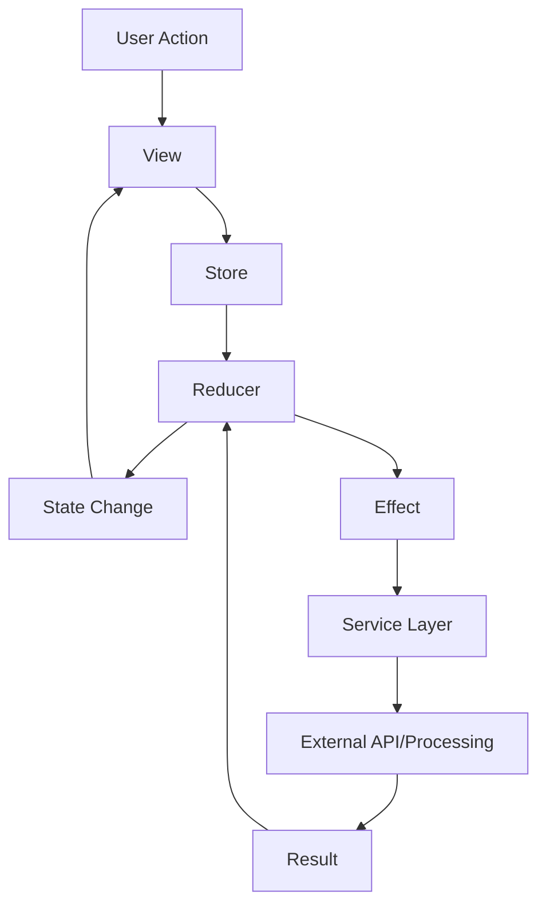

# AIKO Architecture Guide

**Date**: January 16, 2025  
**Version**: 2.1.0 (Clean Architecture)

## Recent Changes (January 16, 2025)

### VanillaIce Infrastructure Removal
- **Complete Separation**: Removed all VanillaIce global command infrastructure that was incorrectly integrated
- **Clean Architecture**: AIKO now has a pure iOS-focused architecture without external command dependencies
- **Cache Infrastructure**: Maintained legitimate offline caching for iOS app functionality
- **Fixed Compilation**: Resolved all errors and warnings for clean builds

## Overview

AIKO is built using a modern, scalable architecture that leverages SwiftUI and The Composable Architecture (TCA) to create a maintainable, testable, and performant application.

## Core Principles

1. **Unidirectional Data Flow**: All state changes flow through reducers
2. **Composition Over Inheritance**: Features are composed of smaller, reusable components
3. **Testability First**: Every component is designed to be easily testable
4. **Platform Agnostic**: Shared code between iOS and macOS platforms
5. **Progressive Disclosure**: UI complexity revealed based on user needs

## Architecture Layers

### 1. Presentation Layer (SwiftUI Views)

```swift
struct AcquisitionFlowView: View {
    @Bindable var store: StoreOf<AcquisitionFlow>
    
    var body: some View {
        // SwiftUI view implementation
    }
}
```

**Responsibilities:**
- User interface rendering
- User interaction handling
- Binding to TCA stores
- Platform-specific UI adaptations

### 2. Feature Layer (TCA Reducers)

```swift
@Reducer
struct AcquisitionFlow {
    @ObservableState
    struct State: Equatable {
        var currentStep: Step = .documentUpload
        var extractedData: ExtractedData?
        var userResponses: [String: String] = [:]
    }
    
    enum Action {
        case documentUploaded(URL)
        case dataExtracted(ExtractedData)
        case userAnswered(field: String, value: String)
    }
    
    var body: some Reducer<State, Action> {
        Reduce { state, action in
            // Handle actions and return effects
        }
    }
}
```

**Responsibilities:**
- State management
- Action processing
- Side effect coordination
- Business logic orchestration

### 3. Service Layer

```swift
actor DocumentProcessor {
    func processDocument(_ url: URL) async throws -> ExtractedData {
        // Document processing logic
    }
}

class AdaptivePromptingEngine {
    func generateQuestions(from data: ExtractedData) -> [Question] {
        // Adaptive question generation
    }
}
```

**Responsibilities:**
- Core business logic
- External API integration
- Data processing
- Algorithm implementation

### 4. Data Layer

```swift
@Model
class AcquisitionDocument {
    var id: UUID
    var title: String
    var uploadDate: Date
    var extractedData: Data?
    
    init(title: String) {
        self.id = UUID()
        self.title = title
        self.uploadDate = Date()
    }
}
```

**Responsibilities:**
- Data persistence (Core Data)
- Cloud synchronization (CloudKit)
- Local caching
- Data migration

## Key Architectural Patterns

### 1. Dependency Injection

```swift
@Reducer
struct Feature {
    @Dependency(\.documentProcessor) var documentProcessor
    @Dependency(\.apiClient) var apiClient
    
    // Use dependencies in reducer
}
```

### 2. Effect Management

```swift
return .run { send in
    let data = try await documentProcessor.process(url)
    await send(.dataProcessed(data))
}
.catch { error in
    .send(.processingFailed(error))
}
```

### 3. Composition

```swift
var body: some Reducer<State, Action> {
    Reduce { state, action in
        // Parent logic
    }
    .ifLet(\.$documentUpload, action: \.documentUpload) {
        DocumentUploadFeature()
    }
    .ifLet(\.$adaptivePrompting, action: \.adaptivePrompting) {
        AdaptivePromptingFeature()
    }
}
```

## Data Flow Example



## Module Structure

```
AIKO/
├── App/
│   ├── AIKOApp.swift          # App entry point
│   └── AppDelegate.swift      # macOS delegate
├── Features/
│   ├── AcquisitionFlow/       # Main workflow
│   ├── DocumentUpload/        # Document handling
│   ├── AdaptivePrompting/     # Question engine
│   ├── Compliance/            # FAR/DFAR checking
│   └── Settings/              # User preferences
├── Services/
│   ├── DocumentProcessor/     # OCR and parsing
│   ├── AIService/            # AI integration
│   ├── ComplianceEngine/     # Regulation checking
│   └── NetworkClient/        # API communication
├── Models/
│   ├── CoreData/             # Persistence models
│   ├── Domain/               # Business models
│   └── DTO/                  # Data transfer objects
├── Resources/
│   ├── Assets/               # Images and colors
│   ├── Regulations/          # FAR/DFAR files
│   └── Forms/                # Form templates
└── Utilities/
    ├── Extensions/           # Swift extensions
    ├── Helpers/              # Utility functions
    └── Constants/            # App constants
```

## Testing Strategy

### 1. Unit Tests
- Reducer logic testing
- Service layer testing
- Model validation

### 2. Integration Tests
- Feature interaction testing
- API integration testing
- Database operation testing

### 3. UI Tests
- User flow testing
- Accessibility testing
- Platform compatibility

### 4. Performance Tests
- Document processing speed
- Memory usage optimization
- Large data set handling

## Security Considerations

1. **Data Encryption**
   - All sensitive data encrypted at rest
   - TLS 1.3 for network communication
   - Keychain storage for credentials

2. **Authentication**
   - Biometric authentication support
   - JWT token management
   - Session timeout handling

3. **Authorization**
   - Role-based access control
   - Feature-level permissions
   - Data-level security

## Performance Optimizations

1. **Lazy Loading**
   - Documents loaded on demand
   - Regulation files cached intelligently
   - Image optimization for UI

2. **Concurrent Processing**
   - Parallel document extraction
   - Background queue management
   - Async/await throughout

3. **Memory Management**
   - Automatic resource cleanup
   - Image downsampling
   - Data pagination

## Future Architectural Enhancements

1. **Modularization**
   - Split features into separate packages
   - Dynamic feature loading
   - Reduced app binary size

2. **Plugin Architecture**
   - Third-party integration support
   - Custom workflow extensions
   - API marketplace

3. **Offline-First**
   - Complete offline functionality
   - Smart synchronization
   - Conflict resolution

## Best Practices

1. **Code Organization**
   - One feature per folder
   - Clear separation of concerns
   - Consistent naming conventions

2. **State Management**
   - Minimal state in views
   - Single source of truth
   - Immutable state updates

3. **Error Handling**
   - Comprehensive error types
   - User-friendly error messages
   - Automatic retry logic

4. **Documentation**
   - Code comments for complex logic
   - README files in feature folders
   - API documentation generation

---

*This architecture is designed to scale with the application's growth while maintaining clarity and testability.*