# AIKO Project Tasks - Simplified 7-Phase Plan

**Project**: AIKO (Adaptive Intelligence for Kontract Optimization)  
**Version**: 5.2 (Enhanced Document Processing)  
**Date**: January 21, 2025  
**Status**: In Progress (Phases 1-3.5 Complete, Phase 4.1 Complete, Swift 6 Migration Complete, Task 4.2.1 Complete)  

---

## 🎯 Project Vision

Build a focused iOS productivity tool that revolutionizes government contracting by leveraging user-chosen LLM providers for all intelligence features. No backend services, no cloud complexity - just powerful automation through a simple native interface.

**Core Philosophy**: Let LLMs handle intelligence. Let iOS handle the interface. Let users achieve more with less effort.

---

## 🔧 Recent Architecture Cleanup (January 16-17, 2025)

### Completed Tasks ✅
- **Remove VanillaIce Infrastructure**: Deleted all global command code (TokenGuardrails, OpenRouterSyncAdapter)
- **Fix Compilation Errors**: Resolved all errors in FollowOnActionService and BackgroundSyncHandler
- **Fix Build Warnings**: Cleaned up unused variables and immutable values in UnifiedChatFeature
- **Verify Cache System**: Ensured offline caching works correctly without VanillaIce dependencies
- **Clean Build**: Project now compiles without errors or warnings

### Additional Cleanup (January 17, 2025) ✅
- **API-Agnostic Refactoring**: Removed obsolete ClaudeAPIIntegration.swift
- **Context7Service**: Refactored as MockContext7Service for testing purposes
- **Import Fixes**: Added AppCore imports to 18+ files that needed DocumentType
- **LLM Provider Updates**: Fixed main actor isolation and string interpolation warnings
- **DocumentExecutionFeature**: Fixed rtfContent generation using RTFFormatter
- **Cross-Branch Sync**: Successfully pushed all fixes to newfeet, backup, and skunk branches

### Swift 6 Strict Concurrency Migration (January 20, 2025) ✅
- **Complete Migration**: 100% Swift 6 strict concurrency compliance achieved
- **Sendable Conformance**: Added Sendable to all required types for safe actor boundary crossing
- **Actor Isolation**: Fixed all main actor isolation conflicts with proper capture lists and protocol wrappers
- **Data Race Prevention**: Resolved async closure capture issues and ShareFeature data races
- **Type Corrections**: Fixed CoreData vs AppCore model type mismatches
- **Property Access**: Updated all property references and fixed optional binding errors
- **Build Success**: Project now compiles without errors or warnings under Swift 6 strict concurrency
- **Final Commit**: Pushed to skunk branch (9d22169d) with comprehensive documentation

### Phase 4.1 Enhanced Image Processing (January 19, 2025) ✅
- **Core Image API Modernization**: Fixed deprecation warnings in iOSDocumentImageProcessor.swift
- **Swift Concurrency Compliance**: Implemented actor-based ProgressTracker for thread-safe progress reporting
- **Enhanced Processing Modes**: Added basic and enhanced image processing with quality metrics
- **OCR Optimization**: Implemented specialized filters for text recognition and document clarity
- **Performance Improvements**: Added processing time estimation and Metal GPU acceleration
- **Comprehensive Testing**: Created full test suite for DocumentImageProcessor functionality
- **Documentation**: Added detailed Phase 4.1 documentation with usage examples

### Phase 4.2.1 AikoCompat Migration (January 21, 2025) ✅
- **Migration Assessment**: Confirmed SwiftAnthropic to AikoCompat migration already complete
- **Architecture Verification**: All services properly using AIProviderFactory.defaultProvider()
- **Build Validation**: Clean build with Swift 6 concurrency compliance maintained
- **Integration Confirmed**: AnthropicWrapper.swift properly implements AIProvider protocol
- **Service Integration**: AIDocumentGenerator, AcquisitionChatFeature, and all LLM services using AikoCompat
- **Status**: Task complete - infrastructure ready for VisionKit scanner implementation

---

## 📋 Master Task List

### Phase 1: Foundation & Architecture ✅ COMPLETE

#### Task 1: Project Setup and Core Infrastructure ✅
- **1.1** Initialize SwiftUI + TCA project structure ✅
- **1.2** Configure development environment ✅
- **1.3** Set up Core Data for local persistence ✅
- **1.4** Create comprehensive documentation structure ✅
- **1.5** Establish project architecture patterns ✅

**Status**: Complete (January 2025)

---

### Phase 2: Resources & Templates ✅ COMPLETE

#### Task 2: Build Resource Foundation ✅
- **2.1** Document templates ✅
  - DD1155, SF1449, SF18, SF26, SF30, SF33, SF44, etc.
- **2.2** Import FAR/DFARS regulations ✅
- **2.3** Build clause libraries ✅
- **2.4** Structure resource access system ✅
- **2.5** Implement template management ✅

**Status**: Complete (January 2025)

---

### Phase 3: LLM Integration ✅ COMPLETE

#### Task 3: Multi-Provider LLM System ✅
- **3.1** Design LLMProviderProtocol ✅
- **3.2** Implement provider adapters ✅
  - OpenAI, Claude, Gemini, Azure OpenAI
- **3.3** Build secure API key storage (Keychain) ✅
- **3.4** Create provider selection UI ✅
- **3.5** Implement conversation state management ✅
- **3.6** Add context-aware generation ✅

**Status**: Complete (January 2025)

---

### Phase 3.5: Triple Architecture Migration 📅 (1 week) - ✅ COMPLETE

#### Task 3.5: Complete Platform Separation
- **3.5.1** Phase 3 - Create Platform Implementations ✅ COMPLETE
  - ✅ Complete missing platform-specific implementations
  - ✅ Migrate 153+ `#if os(iOS)` conditionals to proper modules
  - ✅ Focus on high-impact files (AppView.swift had 23 conditionals)
  - **Progress**: 153+ conditionals migrated (100% complete)
    - ✅ VoiceRecordingService (7 conditionals) - Migrated to iOSVoiceRecordingClient & macOSVoiceRecordingClient
    - ✅ HapticManager (5 conditionals) - Migrated to iOSHapticManagerClient & macOSHapticManagerClient
    - ✅ Updated all HapticManager.shared references to use dependency injection
    - ✅ Fixed voiceRecordingService references to use voiceRecordingClient
    - ✅ SAMReportPreview (9 conditionals) - Migrated to platform-specific implementations
    - ✅ EnhancedAppView (8 conditionals) - Migrated to platform services
    - ✅ OnboardingStepViews (8 conditionals) - Migrated to platform abstractions
    - ✅ LLMProviderSettingsView (7 conditionals) - Migrated to platform-specific UI
    - ✅ Theme.swift - All color and modifier conditionals migrated
    - ✅ DynamicType.swift - Font scaling conditionals migrated
    - ✅ Accessibility+Extensions.swift - VoiceOver notifications migrated
    - ✅ VisualEffects.swift - Blur effect conditionals migrated
    - ✅ All remaining UI files migrated to platform-specific implementations
  
- **3.5.2** Phase 4 - Refactor Views ✅ COMPLETE
  - ✅ Separate iOS and macOS view implementations
  - ✅ Create platform-specific view modules (iOSNavigationStack, macOSNavigationStack, etc.)
  - ✅ Eliminate view-level conditionals
  - ✅ Implement PlatformViewServiceProtocol with dependency injection
  
- **3.5.3** Phase 5 - Testing & Validation ⏳ IN PROGRESS
  - ⏳ Unit tests for AppCore
  - 📅 Integration tests for platform modules
  - 📅 Validate clean separation of concerns

**Timeline**: Week 1 (before Document Scanner) - ✅ COMPLETED
**Priority**: CRITICAL - Technical debt blocking clean implementation
**Impact**: Reduced 153+ conditionals to 0, dramatically improved maintainability
**Completion Date**: January 19, 2025

---

### Phase 4: Document Scanner & Capture 📅 (2 weeks)

#### Task 4.1: Enhanced Image Processing ✅ COMPLETE
- **4.1.1** Core Image Modernization ✅
  - Fixed deprecated Core Image API calls
  - Implemented modern filter initialization patterns
  - Added Metal GPU acceleration support
  
- **4.1.2** Swift Concurrency Compliance ✅
  - Actor-based progress tracking for thread safety
  - Sendable closure implementations
  - Async/await pattern integration
  
- **4.1.3** Processing Modes ✅
  - Basic mode: Fast processing for speed
  - Enhanced mode: Advanced filters for quality
  - OCR optimization: Specialized text recognition
  - Quality metrics and confidence scoring
  
- **4.1.4** Performance & Testing ✅
  - Processing time estimation
  - Comprehensive test suite
  - Documentation and examples

#### Task 4.2: Professional Document Scanner 📅 IN PROGRESS

- **4.2.1** AikoCompat Migration ✅ COMPLETE
  - Verified SwiftAnthropic to AikoCompat migration already complete
  - All services using AIProviderFactory.defaultProvider()
  - Clean build with Swift 6 concurrency compliance
  - AnthropicWrapper.swift properly implementing AIProvider protocol

- **4.2.2** VisionKit Integration 📅 CURRENT TASK
  - Edge detection & auto-crop
  - Multi-page scanning support
  - Perspective correction
  - Integration with enhanced image processing
  
- **4.2.3** OCR Integration
  - Connect to existing UnifiedDocumentContextExtractor
  - Automatic text extraction with enhanced preprocessing
  - Form field detection
  - Metadata extraction
  
- **4.2.4** Scanner UI/UX
  - One-tap scanning from any screen
  - Review and edit captures
  - Batch scanning mode
  - Quick actions (email, save, process)
  
- **4.2.5** Smart Processing
  - Auto-populate forms from enhanced scans
  - Extract vendor information
  - Create documents from processed scans
  - Smart filing based on content

**Timeline**: Weeks 2-3 (Phase 4.1 Complete ✅, Phase 4.2.1 Complete ✅, Phase 4.2.2 Current)
**Priority**: HIGH - Most requested feature
**Status**: Phase 4.2.1 Complete ✅, Phase 4.2.2 Next Priority

---

### Phase 5: Smart Integrations & Provider Flexibility 📅 (1.5 weeks)

#### Task 5: iOS Native Integrations
- **5.1** Document Picker
  - UIDocumentPickerViewController implementation
  - Support for iCloud Drive, Google Drive, Dropbox
  - Import documents from any service
  - No authentication required
  
- **5.2** iOS Mail Integration
  - MFMailComposeViewController
  - Attach generated documents
  - Pre-filled templates
  - Native mail experience
  
- **5.3** Calendar & Reminders
  - EventKit framework integration
  - Create deadline events
  - Set approval reminders
  - Read calendar for scheduling

#### Task 6: Local Security
- **6.1** Biometric Authentication
  - LocalAuthentication framework
  - Face ID/Touch ID support
  - Secure document access
  - Fallback to device passcode

#### Task 7: Vendor Search
- **7.1** Google Maps Integration
  - Maps SDK for iOS
  - Search vendor locations
  - Display contact info
  - Save preferred vendors

#### Task 8: LLM-Powered Intelligence Features
- **8.1** Prompt Optimization Engine
  - One-tap enhancement icon in chat
  - 15+ prompt patterns:
    * Instruction patterns (plain, role-based, output format)
    * Example-based (few-shot, one-shot templates)
    * Reasoning boosters (CoT, self-consistency, tree-of-thought)
    * Knowledge injection (RAG, ReAct, PAL)
  - Task-specific tags (summarize, extract, classify)
  - LLM rewrites prompts intelligently
  
- **8.2** Universal Provider Support
  - "Add Custom Provider" wizard
  - Automatic API structure detection
  - Dynamic adapter generation
  - Support any OpenAI-compatible API
  - Secure configuration storage

#### Task 8.5: File Upload & Document Capture System 📅 CRITICAL
- **8.5.1** File Input Methods
  - **Upload file** → Standard file picker integration
  - **Upload photo** → Photo library access with selection
  - **Scan document** → Integration with VisionKit document scanner
  - **Take photo** → Camera capture for documents
  - **Take screenshot** → Screen capture functionality
  
- **8.5.2** Processing Pipeline
  - **Automatic OCR** → Text extraction from all input types
  - **Format Detection** → PDF, image, document type recognition
  - **Quality Enhancement** → Image preprocessing for better OCR
  - **Metadata Extraction** → Document properties and context
  
- **8.5.3** Integration Features
  - **Direct Chat Input** → Upload and immediately discuss with LLM
  - **Document Library** → Save and organize captured documents
  - **Template Population** → Auto-fill forms from captured data
  - **Workflow Triggers** → Initiate processes based on document type

#### Task 8.3: Launch-Time Regulation Fetcher 📅 CRITICAL
- **8.3.1** Regulatory Data System
  - **Launch-time fetch** during onboarding after user profile entry
  - Support for **cellular & WiFi** connectivity options
  - **Auto-update every 7 days** with user preference settings
  - Download comprehensive regulation set:
    * **FAR** (Federal Acquisition Regulation)
    * **DFARS** (Defense Federal Acquisition Regulation Supplement)
    * **DFARS PGI** (Procedures, Guidance, and Information)
    * **AFARS** (Army Federal Acquisition Regulation Supplement)
    * **DAFFARS** (Department of Air Force Federal Acquisition Regulation Supplement)
    * **DAFFARS MP** (Management Procedures)
    * **SOFARS** (Special Operations Federal Acquisition Regulation Supplement)
    * **Agency-specific regulations** based on user profile Agency/Dept/Service field
  - Source: **https://www.acquisition.gov/content/developers-page#github-repositories**
  - **Local device storage** for offline parsing, lookup, and feature integration
  - **Testing disclaimer**: Current project resource folder regulations are for testing only, not for app release
  
- **8.3.2** Smart Update Engine
  - Version comparison and conflict detection
  - User notification for significant changes
  - Optional manual override for critical updates
  - Integration with existing regulation search
  - **Delta synchronization** for efficient updates
  - Background refresh capability with offline fallback
  
- **8.3.3** Performance Optimization
  - Compressed data formats
  - Incremental loading
  - Background processing
  - Progress indicators for large updates

#### Task 8.4: iPad Compatibility & Apple Pencil Integration 📅 CRITICAL
- **8.4.1** iPad UI Enhancements
  - Multi-column layouts for large screens
  - Sidebar navigation optimization
  - Split-view document editing
  - Optimized keyboard shortcuts
  
- **8.4.2** Apple Pencil Features
  - Document annotation and markup
  - **Signature capture for generated forms/documents** when applicable as an option
  - **Professional signature workflow** with capture, review, and embed functionality
  - Handwritten notes integration
  - Sketch-to-requirement conversion
  - **PencilKit integration** for natural writing experience
  
- **8.4.3** Enhanced Productivity
  - Drag-and-drop between documents
  - Multiple document windows
  - Enhanced multitasking support
  - Professional document review workflows
  - **Form completion workflow** with Apple Pencil signature integration

**Timeline**: Week 4 + half of Week 5  
**Priority**: HIGH - Core functionality

---

### Phase 6: LLM Intelligence & Compliance Automation 📅 (2 weeks)

#### Task 9: Intelligent Workflow System 📅 CRITICAL - BMAD-METHOD STYLE
- **9.1** BMAD-Method Workflow Framework
  - **Background process** of logical acquisition workflow framework
  - **User + LLM Brainstorming** → requirement gathering until sufficient information
  - **PRD Creation** → LLM generates Technical Specifications report, or SOO, SOW, or PWS w/QASP
  - **Architecture/Design** → LLM creates Acquisition Strategy (regulation compliant)
  - **Document Chain Orchestration** → formulates complete document chain
  - **Uses main appview categories (requirements studio, market intel, planning, soliciation, award as Epics. Each epic has multiple stories.)
  - **Reference Implementation**: https://github.com/bmadcode/BMAD-METHOD.git
  
- **9.2** Acquisition Process Epic Management
  - **Main App View Categories** → Document categories become epics:
    * **Market Intelligence** epic
    * **Planning** epic
    * **Solicitation** epic
    * **Award** epic
    * **Post-Award** epic
    * **Closeout** epic
  - **Epic Sharding** → Model breaks each epic into manageable "stories"
  - **Story Breakdown** → Each story divided into phases, tasks, and subtasks
  
- **9.3** Quality Assurance & Testing Framework
  - **Story Completion** → Testing and QA before moving to next story
  - **Process Control** → LLM internal process OR user approval (user preference)
  - **Defined Metrics** through multiple evaluation lenses:
    * **OCR Recognition/Data Values** → accuracy metrics
    * **Forms and Documents Generation** → completeness metrics
    * **Regulation Check** → compliance verification
  - **MoE** (Measures of Effectiveness)
  - **MoP** (Measures of Performance)
  - **DoS** (Definition of Success)
  - **DoD** (Definition of Done)
  
- **9.4** Analytics Integration
  - **Evaluation Data** → feeds into Analytics category
  - **User Information** → performance insights
  - **Workflow Optimization** → continuous improvement based on metrics
  - **Integration** with existing UnifiedChatFeature capabilities

#### Task 10: Document Chain Orchestration
- **10.1** Chain Builder
  - Dependency-aware generation
  - Critical path optimization
  - Visual progress tracking
  - Automatic sequencing
  - **TODO**: Implement Document Chain Strategy builder
  
- **10.2** Review Modes
  - **TODO**: Implement iterative vs batch review modes
  - User-selectable preferences:
    * Iterative: Review each as generated
    * Batch: Generate all, then review
  - Simple toggle in settings
  - LLM manages review logic

#### Task 11: CASE FOR ANALYSIS Framework
- **11.1** CfA Engine
  - Automatic justification for every AI decision
  - C-A-S-E structure generation:
    * Context: Situation overview
    * Authority: FAR/DFARS citations
    * Situation: Specific analysis
    * Evidence: Supporting data
  - Collapsible cards in UI
  - JSON export for audit trails
  
- **11.2** Transparency Features
  - Confidence scores
  - "Request new CASE" option
  - Citation verification
  - Decision history

#### Task 12: GraphRAG Regulatory Intelligence
- **12.1** Enhanced Search
  - "Deep Analysis" toggle
  - LLM-powered knowledge graph
  - Relationship visualization
  - Conflict detection
  
- **12.2** Smart Citations
  - Confidence-scored references
  - Dependency tracking
  - Cross-reference validation
  - Regulatory updates

#### Task 13: Outcome-Based Contracting Framework 📅 CRITICAL - HARD-CODED DESIGN
- **13.1** Core OBC Architecture
  - **Hard-coded acquisition design** → Outcome-based contracting principles embedded in app logic
  - **Performance-based templates** → Pre-built contract structures focused on results
  - **Success metrics definition** → Quantifiable outcome measurements built into planning
  - **Risk assessment engine** → Automatic evaluation of outcome-based approach viability
  - **Regulatory compliance** → FAR Part 37.6 Performance-Based Acquisition integration
  
- **13.2** Acquisition Planning Integration
  - **Requirements analysis** → LLM converts traditional requirements to outcome statements
  - **Performance work statements** → Automated PWS generation with outcome focus
  - **Quality assurance surveillance plans** → Built-in QASP templates for outcomes
  - **Incentive structure design** → Performance incentives and penalties framework
  - **Market research guidance** → Outcome-capability vendor assessment tools
  
- **13.3** Contract Design & Execution
  - **Contract type selection** → Intelligent recommendation for outcome-based contract types
  - **Payment structure** → Performance-based payment schedules and milestones
  - **Deliverable definitions** → Outcome-focused deliverable specifications
  - **Evaluation criteria** → Weighted evaluation factors emphasizing outcomes
  - **Post-award management** → Performance monitoring and outcome tracking tools
  
- **13.4** Performance Measurement & Analytics
  - **KPI dashboard** → Real-time outcome achievement tracking
  - **Variance analysis** → Automatic detection of outcome gaps
  - **Corrective action triggers** → Workflow automation for performance issues
  - **Historical performance** → Vendor outcome-based performance database
  - **Continuous improvement** → Outcome-based contracting strategy refinement
  
- **13.5** Regulatory & Compliance Engine
  - **FAR/DFARS compliance** → Automated compliance checking for OBC approaches
  - **Agency-specific guidance** → Tailored OBC implementation based on user profile
  - **Best practices library** → Curated successful outcome-based contracting examples
  - **Risk mitigation** → Built-in safeguards and fallback strategies
  - **Audit trail** → Complete documentation for outcome-based decision rationale

**Timeline**: Weeks 5.5-7.5  
**Priority**: CRITICAL - Revolutionary contracting approach  
**Implementation**: Hard-coded into app's core acquisition logic

---

### Phase 7: Polish & App Store Release 📅 (2 weeks)

#### Task 14: Performance Optimization
- **14.1** Code Cleanup
  - Remove unused code
  - Optimize app size (< 50MB)
  - Memory management
  - Battery optimization
  
- **14.2** Performance Tuning
  - Launch time optimization
  - Smooth animations
  - Efficient data handling
  - Background task management

#### Task 15: Quality Assurance
- **15.1** Testing Suite
  - Unit tests for services
  - UI/UX testing
  - Integration testing
  - Edge case handling
  
- **15.2** Accessibility
  - VoiceOver support
  - Dynamic type
  - Color contrast
  - Gesture alternatives

#### Task 16: App Store Preparation
- **16.1** Store Assets
  - Screenshots (all device sizes)
  - App preview video
  - Compelling description
  - Keywords optimization
  
- **16.2** Documentation
  - Privacy policy (LLM providers)
  - Terms of service
  - Support documentation
  - FAQ section

#### Task 17: Launch Preparation
- **17.1** Beta Testing
  - TestFlight deployment
  - Feedback collection
  - Critical bug fixes
  - Performance validation
  
- **17.2** Marketing
  - Launch announcement
  - Feature highlights
  - User testimonials
  - App Store submission

**Timeline**: Weeks 7.5-8.5  
**Priority**: CRITICAL - Final delivery

---

## 📊 Progress Overview

### Total Tasks: 21 Main Tasks (94 Subtasks)

### Completed: 6/21 Main Tasks (29%) + Swift 6 Migration
- ✅ Phase 1: Foundation & Architecture
- ✅ Phase 2: Resources & Templates  
- ✅ Phase 3: LLM Integration
- ✅ Phase 3.5: Triple Architecture Migration
- ✅ Phase 4.1: Enhanced Image Processing
- ✅ Phase 4.2.1: AikoCompat Migration
- ✅ Swift 6 Strict Concurrency Migration

### In Progress: 1/21 Main Tasks (5%)
- 📅 Phase 4.2.2: VisionKit Document Scanner (CURRENT)

### Planned: 14/21 Main Tasks (66%)
- 📅 Phase 4.2.3-4.2.5: OCR Integration, Scanner UI/UX, Smart Processing
- 📅 Phase 5: Smart Integrations & Provider Flexibility
  - Including Task 8.3: Launch-Time Regulation Fetcher
  - Including Task 8.4: iPad Compatibility & Apple Pencil Integration
  - Including Task 8.5: File Upload & Document Capture System
- 📅 Phase 6: LLM Intelligence & Compliance Automation
  - Including Task 9: Enhanced Intelligent Workflow System (BMAD-Method)
  - Including Task 13: Outcome-Based Contracting Framework (Hard-coded)
- 📅 Phase 7: Polish & App Store Release

---

## 🎯 Current Sprint Focus

**Sprint**: Phase 4.2.2 - VisionKit Document Scanner  
**Duration**: 1.3 weeks remaining  
**Start Date**: January 21, 2025  

**Completed**:
✅ Phase 4.1 - Enhanced Image Processing (Core Image modernization, Swift concurrency, processing modes)
✅ Phase 4.2.1 - AikoCompat Migration (Verified infrastructure ready, clean build, Swift 6 compliance)
✅ Swift 6 Strict Concurrency Migration (100% compliance, zero compilation errors)

**Current Goals**:
1. Implement VisionKit document scanner with edge detection
2. Multi-page scanning support with perspective correction
3. Integration with enhanced image preprocessing pipeline  
4. Prepare foundation for OCR integration in Phase 4.2.3

**Upcoming Integration Tasks**:
- OCR Integration with enhanced preprocessing (Phase 4.2.3)
- One-tap scanning UI/UX (Phase 4.2.4)
- Smart processing for auto-populating forms (Phase 4.2.5)
- Launch-Time Regulation Fetcher (Phase 5)
- iPad Compatibility & Apple Pencil Integration (Phase 5)
- Enhanced Intelligent Workflow System - BMAD-Method (Phase 6)

---

## 📈 Key Milestones

1. **Milestone 1**: Core Foundation (Phases 1-3) - ✅ COMPLETE (January 2025)
2. **Milestone 2**: Clean Architecture (Phase 3.5) - ✅ COMPLETE (January 19, 2025)
3. **Milestone 3**: Enhanced Image Processing (Phase 4.1) - ✅ COMPLETE (January 19, 2025)
4. **Milestone 3.5**: AikoCompat Migration (Phase 4.2.1) - ✅ COMPLETE (January 21, 2025)
5. **Milestone 4**: Document Scanner (Phase 4.2) - February 5, 2025
6. **Milestone 5**: Smart Integrations (Phase 5) - February 15, 2025
   - Including Launch-Time Regulation Fetcher
   - Including iPad Compatibility & Apple Pencil Integration
7. **Milestone 6**: Enhanced Workflow Automation & Outcome-Based Contracting (Phase 6) - March 1, 2025
8. **Milestone 7**: App Store Launch (Phase 7) - March 15, 2025

---

## 🔄 Task Dependencies

```mermaid
graph TD
    A[Phases 1-3 ✅] --> B[Phase 3.5: Architecture ✅]
    B --> C[Phase 4.1: Enhanced Image Processing ✅]
    C --> D[Phase 4.2.1: AikoCompat Migration ✅]
    D --> E[Phase 4.2.2: VisionKit Scanner - CURRENT]
    E --> F[Phase 4.2.3: OCR Integration]
    F --> G[Phase 5: Smart Integrations]
    G --> H[Task 8.3: Regulation Fetcher]
    G --> I[Task 8.4: iPad Compatibility]
    H --> J[Phase 6: Enhanced Intelligence]
    I --> J
    J --> K[Task 9: Intelligent Workflow System]
    K --> L[Phase 7: Launch]
```

---

## Success Metrics

### Technical Goals
- **App Size**: < 50MB
- **Scanner Accuracy**: > 95%
- **LLM Response Time**: < 3 seconds
- **Prompt Optimization**: < 3 seconds
- **CfA Generation**: Automatic with every decision
- **Citation Accuracy**: > 95% with GraphRAG

### User Experience Goals
- **Onboarding**: < 2 minutes
- **First Document**: < 3 minutes
- **Provider Setup**: < 5 steps
- **Decision Transparency**: 100% with CfA
- **Workflow Creation**: < 30 seconds

---

## 📝 Notes

- Focus on iOS-native functionality
- All intelligence via user's LLM API keys
- No AIKO backend services
- Privacy through direct API calls
- Simple, powerful, focused

---

**Last Updated**: January 21, 2025  
**Next Review**: January 24, 2025  
**Project Philosophy**: Simple iOS app, powerful LLM intelligence
