# AIKO Project Tasks - Simplified 7-Phase Plan

**Project**: AIKO (Adaptive Intelligence for Kontract Optimization)  
**Version**: 5.0 (LLM-Powered iOS)  
**Date**: January 16, 2025  
**Status**: In Progress (Phases 1-3 Complete)  

---

## 🎯 Project Vision

Build a focused iOS productivity tool that revolutionizes government contracting by leveraging user-chosen LLM providers for all intelligence features. No backend services, no cloud complexity - just powerful automation through a simple native interface.

**Core Philosophy**: Let LLMs handle intelligence. Let iOS handle the interface. Let users achieve more with less effort.

---

## 📋 Master Task List

### Phase 1: Foundation & Architecture ✅ COMPLETE

#### Task 1: Project Setup and Core Infrastructure ✅
- **1.1** Initialize SwiftUI + TCA project structure ✅
- **1.2** Configure development environment ✅
- **1.3** Set up Core Data for local persistence ✅
- **1.4** Create comprehensive documentation structure ✅
- **1.5** Establish project architecture patterns ✅

**Status**: Complete (January 2025)

---

### Phase 2: Resources & Templates ✅ COMPLETE

#### Task 2: Build Resource Foundation ✅
- **2.1** Document templates ✅
  - DD1155, SF1449, SF18, SF26, SF30, SF33, SF44, etc.
- **2.2** Import FAR/DFARS regulations ✅
- **2.3** Build clause libraries ✅
- **2.4** Structure resource access system ✅
- **2.5** Implement template management ✅

**Status**: Complete (January 2025)

---

### Phase 3: LLM Integration ✅ COMPLETE

#### Task 3: Multi-Provider LLM System ✅
- **3.1** Design LLMProviderProtocol ✅
- **3.2** Implement provider adapters ✅
  - OpenAI, Claude, Gemini, Azure OpenAI
- **3.3** Build secure API key storage (Keychain) ✅
- **3.4** Create provider selection UI ✅
- **3.5** Implement conversation state management ✅
- **3.6** Add context-aware generation ✅

**Status**: Complete (January 2025)

---

### Phase 4: Document Scanner & Capture 📅 (2 weeks)

#### Task 4: Professional Document Scanner
- **4.1** Implement VisionKit document scanner
  - Edge detection & auto-crop
  - Multi-page scanning support
  - Perspective correction
  - Quality enhancement filters
  
- **4.2** OCR Integration
  - Connect to existing UnifiedDocumentContextExtractor
  - Automatic text extraction
  - Form field detection
  - Metadata extraction
  
- **4.3** Scanner UI/UX
  - One-tap scanning from any screen
  - Review and edit captures
  - Batch scanning mode
  - Quick actions (email, save, process)
  
- **4.4** Smart Processing
  - Auto-populate forms from scans
  - Auto-populate data from scans
  - Extract vendor information
  - Create documents from scans
  - Smart filing based on content

**Timeline**: Weeks 1-2  
**Priority**: HIGH - Most requested feature

---

### Phase 5: Smart Integrations & Provider Flexibility 📅 (1.5 weeks)

#### Task 5: iOS Native Integrations
- **5.1** Document Picker
  - UIDocumentPickerViewController implementation
  - Support for iCloud Drive, Google Drive, Dropbox
  - Import documents from any service
  - No authentication required
  
- **5.2** iOS Mail Integration
  - MFMailComposeViewController
  - Attach generated documents
  - Pre-filled templates
  - Native mail experience
  
- **5.3** Calendar & Reminders
  - EventKit framework integration
  - Create deadline events
  - Set approval reminders
  - Read calendar for scheduling

#### Task 6: Local Security
- **6.1** Biometric Authentication
  - LocalAuthentication framework
  - Face ID/Touch ID support
  - Secure document access
  - Fallback to device passcode

#### Task 7: Vendor Search
- **7.1** Google Maps Integration
  - Maps SDK for iOS
  - Search vendor locations
  - Display contact info
  - Save preferred vendors

#### Task 8: LLM-Powered Intelligence Features
- **8.1** Prompt Optimization Engine
  - One-tap enhancement icon in chat
  - 15+ prompt patterns:
    * Instruction patterns (plain, role-based, output format)
    * Example-based (few-shot, one-shot templates)
    * Reasoning boosters (CoT, self-consistency, tree-of-thought)
    * Knowledge injection (RAG, ReAct, PAL)
  - Task-specific tags (summarize, extract, classify)
  - LLM rewrites prompts intelligently
  
- **8.2** Universal Provider Support
  - "Add Custom Provider" wizard
  - Automatic API structure detection
  - Dynamic adapter generation
  - Support any OpenAI-compatible API
  - Secure configuration storage

**Timeline**: Week 3 + half of Week 4  
**Priority**: HIGH - Core functionality

---

### Phase 6: LLM Intelligence & Compliance Automation 📅 (2 weeks)

#### Task 9: Intelligent Workflow System
- **9.1** Workflow Engine
  - Event-driven triggers
  - LLM-orchestrated actions
  - Progress tracking
  - Error recovery
  
- **9.2** Follow-On Actions
  - LLM-suggested next steps
  - Action cards with one-tap execution
  - Dependency management
  - Priority indicators
  - Parallel task execution (up to 3)

#### Task 10: Document Chain Orchestration
- **10.1** Chain Builder
  - Dependency-aware generation
  - Critical path optimization
  - Visual progress tracking
  - Automatic sequencing
  
- **10.2** Review Modes
  - User-selectable preferences:
    * Iterative: Review each as generated
    * Batch: Generate all, then review
  - Simple toggle in settings
  - LLM manages review logic

#### Task 11: CASE FOR ANALYSIS Framework
- **11.1** CfA Engine
  - Automatic justification for every AI decision
  - C-A-S-E structure generation:
    * Context: Situation overview
    * Authority: FAR/DFARS citations
    * Situation: Specific analysis
    * Evidence: Supporting data
  - Collapsible cards in UI
  - JSON export for audit trails
  
- **11.2** Transparency Features
  - Confidence scores
  - "Request new CASE" option
  - Citation verification
  - Decision history

#### Task 12: GraphRAG Regulatory Intelligence
- **12.1** Enhanced Search
  - "Deep Analysis" toggle
  - LLM-powered knowledge graph
  - Relationship visualization
  - Conflict detection
  
- **12.2** Smart Citations
  - Confidence-scored references
  - Dependency tracking
  - Cross-reference validation
  - Regulatory updates

**Timeline**: Weeks 4.5-6.5  
**Priority**: HIGH - Key differentiators

---

### Phase 7: Polish & App Store Release 📅 (2 weeks)

#### Task 13: Performance Optimization
- **13.1** Code Cleanup
  - Remove unused code
  - Optimize app size (< 50MB)
  - Memory management
  - Battery optimization
  
- **13.2** Performance Tuning
  - Launch time optimization
  - Smooth animations
  - Efficient data handling
  - Background task management

#### Task 14: Quality Assurance
- **14.1** Testing Suite
  - Unit tests for services
  - UI/UX testing
  - Integration testing
  - Edge case handling
  
- **14.2** Accessibility
  - VoiceOver support
  - Dynamic type
  - Color contrast
  - Gesture alternatives

#### Task 15: App Store Preparation
- **15.1** Store Assets
  - Screenshots (all device sizes)
  - App preview video
  - Compelling description
  - Keywords optimization
  
- **15.2** Documentation
  - Privacy policy (LLM providers)
  - Terms of service
  - Support documentation
  - FAQ section

#### Task 16: Launch Preparation
- **16.1** Beta Testing
  - TestFlight deployment
  - Feedback collection
  - Critical bug fixes
  - Performance validation
  
- **16.2** Marketing
  - Launch announcement
  - Feature highlights
  - User testimonials
  - App Store submission

**Timeline**: Weeks 6.5-7.5  
**Priority**: CRITICAL - Final delivery

---

## 📊 Progress Overview

### Total Tasks: 16 Main Tasks (68 Subtasks)

### Completed: 3/16 Main Tasks (18.8%)
- ✅ Phase 1: Foundation & Architecture
- ✅ Phase 2: Resources & Templates  
- ✅ Phase 3: LLM Integration

### Remaining: 13/16 Main Tasks (81.2%)
- 📅 Phase 4: Document Scanner & Capture
- 📅 Phase 5: Smart Integrations & Provider Flexibility
- 📅 Phase 6: LLM Intelligence & Compliance Automation
- 📅 Phase 7: Polish & App Store Release

---

## 🎯 Current Sprint Focus

**Sprint**: Phase 4 - Document Scanner & Capture  
**Duration**: 2 weeks  
**Start Date**: January 17, 2025  

**Goals**:
1. Implement VisionKit scanner with edge detection
2. Build multi-page scanning workflow
3. Integrate OCR for text extraction
4. Create smart filing system

---

## 📈 Key Milestones

1. **Milestone 1**: Core Foundation (Phases 1-3) - ✅ COMPLETE (January 2025)
2. **Milestone 2**: Document Scanner (Phase 4) - January 31, 2025
3. **Milestone 3**: Integrations & Intelligence (Phase 5) - February 7, 2025
4. **Milestone 4**: Workflow Automation (Phase 6) - February 21, 2025
5. **Milestone 5**: App Store Launch (Phase 7) - March 7, 2025

---

## 🔄 Task Dependencies

```mermaid
graph TD
    A[Phases 1-3 ✅] --> B[Phase 4: Scanner]
    B --> C[Phase 5: Integrations]
    C --> D[Phase 6: Intelligence]
    D --> E[Phase 7: Launch]
```

---

## Success Metrics

### Technical Goals
- **App Size**: < 50MB
- **Scanner Accuracy**: > 95%
- **LLM Response Time**: < 3 seconds
- **Prompt Optimization**: < 3 seconds
- **CfA Generation**: Automatic with every decision
- **Citation Accuracy**: > 95% with GraphRAG

### User Experience Goals
- **Onboarding**: < 2 minutes
- **First Document**: < 3 minutes
- **Provider Setup**: < 5 steps
- **Decision Transparency**: 100% with CfA
- **Workflow Creation**: < 30 seconds

---

## 📝 Notes

- Focus on iOS-native functionality
- All intelligence via user's LLM API keys
- No AIKO backend services
- Privacy through direct API calls
- Simple, powerful, focused

---

**Last Updated**: January 16, 2025  
**Next Review**: January 24, 2025  
**Project Philosophy**: Simple iOS app, powerful LLM intelligence
